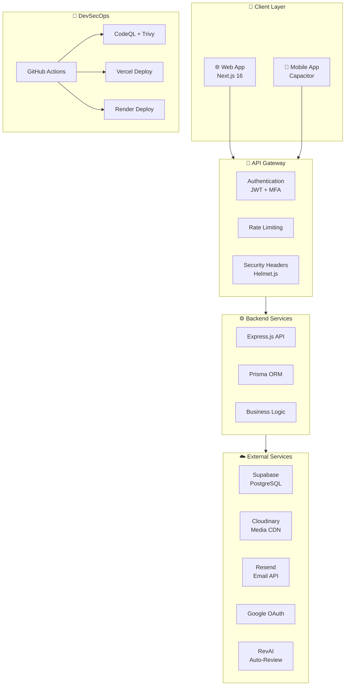

   
  <b>UiTM Tapah</b>
    
   
  <i>Building the Future Through Innovation</i>
    
   
  <b>Team Vecna</b>

<h1 align="center">🏠 RentVerse (Secured by Vecna)</h1>

<i>A Secure Property Rental Platform with DevSecOps Integration</i>

---

## 📋 Challenge Submission Details

[cite_start]**Challenge**: Mobile SecOps 21 Days Challenge [cite: 11]
**Organizer**: Metairflow R&D Sdn. [cite_start]Bhd. [cite: 1]
**Team**: VECNA
**Institution**: UiTM Tapah
[cite_start]**Project Duration**: 27 November 2025 - 17 December 2025 [cite: 12, 13]

---

## 👥 Team Vecna Members

  <table>
    <tr>
      <td align="center" width="250">
         
        <b>MOHAMAD BUKHARI BIN AHMAD HUZAIRI</b> 
        <code>2024916761</code> 
        <i>Backend & Cloud Infrastructure</i>
      </td>
      <td align="center" width="250">
         
        <b>MUHAMAD ZULKARNAIN BIN SAMSUDIN</b> 
        <code>2024793133</code> 
        <i>Frontend & Beta Tester</i>
      </td>
      <td align="center" width="250">
         
        <b>AQIL IMRAN BIN NORHIDZAM</b> 
        <code>2024779269</code> 
        <i>Security Lead</i>
      </td>
    </tr>
  </table>

---

## 🔗 Quick Links

| Platform | Link |
|----------|------|
| 🌐 **Live Website** | [https://rentverse-frontend-nine.vercel.app/](https://rentverse-frontend-nine.vercel.app/) |
| 📱 **Mobile App (APK)** | [Download RentVerse APK](MobileAppBuild/rentverse-vecna.apk) |
| 📚 **API Docs** | [Swagger Documentation](/docs) |

### 🧪 Test Admin Account

> **Note**: MFA is disabled only for this specific account to allow testing of admin functionalities. For non-MFA accounts, you won't be greeted by the Welcome Popup Modal.

| Credential | Value |
|------------|-------|
| 📧 **Email** | `admin@rentverse.com` |
| 🔑 **Password** | `password123` |

> **⚠️ Important**: To test **user** and **landlord** functionalities, you must register with your own **real email address**. Fake emails will not work on this system (both Web and Mobile App) as OTP verification is required.

---

## 📸 Platform Preview

### Web Application
<!-- TODO: Add web-preview.png to github/assets/ -->
*Screenshot coming soon*

### Mobile Application
<!-- TODO: Add mobile-preview.png to github/assets/ -->
*Screenshot coming soon*

---

## 🛡️ Security Compliance Matrix

| Requirement ID | Security Module | Implementation Status | OWASP Alignment |
| :--- | :--- | :---: | :--- |
| **SEC-01** | **Multi-Factor Authentication** | ✅ Implemented | M2: Insecure Authentication |
| **SEC-02** | **API Rate Limiting** | ✅ Implemented | M4: Insufficient Input/Output Validation |
| **SEC-03** | **Data Encryption (At Rest)** | ✅ Implemented | M5: Insecure Data Storage |
| **SEC-04** | **Data Encryption (In Transit)** | ✅ Implemented | M3: Insecure Communication |
| **SEC-05** | **Input Sanitization** | ✅ Implemented | M7: Client Code Quality |
| **SEC-06** | **Audit Logging** | ✅ Implemented | M1: Improper Platform Usage |

---

## 📑 Table of Contents

| Section | Description |
|---------|-------------|
| [👥 Team Members](#-team-members) | Meet Team Vecna |
| [🔗 Quick Links](#-quick-links) | Live demo & download links |
| [📸 Platform Preview](#-platform-preview) | Web & Mobile screenshots |
| [📈 System Flow Diagrams](#-system-flow-diagrams) | Architecture & flow visualizations |
| [🔧 Development Platforms](#-development-platforms) | Hosting & services used |
| **🛡️ Core Development Modules** | |
| [🟢 Module 1: Secure Login & MFA](#-module-1-secure-login--mfa-) | Authentication & Authorization |
| [🔵 Module 2: Secure API Gateway](#-module-2-secure-api-gateway-) | HTTPS, JWT, Rate Limiting |
| [🟣 Module 3: Sensitive Data Handling](#-module-3-sensitive-data-handling-) | Encryption & Secure Storage |
| [🟠 Module 4: Secure Session Management](#-module-4-secure-session-management-) | Token Lifecycle & Blacklisting |
| [🩷 Module 5: Input Validation & Defense](#-module-5-input-validation--defense-) | XSS, SQL Injection Prevention |
| [🔷 Module 6: DevSecOps Integration](#-module-6-devsecops-integration-) | CI/CD Security Pipeline |
| **🚀 Feature Innovation Pool** | |
| [🟡 Category 1: Threat Intelligence](#-category-1-threat-intelligence-system-️) | Risk scoring & pattern detection |
| [🟪 Category 2: Zero-Trust Access](#-category-2-zero-trust-access-logic-) | Device verification & session control |
| [🟩 Category 3: Adaptive Defense](#-category-3-adaptive-defense-dashboard-) | Security monitoring dashboard |
| [🟫 Category 4: Automated Testing](#-category-4-automated-security-testing-) | CI/CD security scanning |
| **✨ Special Features** | |
| [📝 Digital Rental Agreements](#-digital-rental-agreements) | E-signatures & PDF generation |
| [🔐 OTP-Based Password Reset](#-otp-based-password-reset) | Secure password recovery |
| [📧 Smart Email Notifications](#-smart-email-notification-system) | Responsive email templates |
| [👑 Admin Dashboard](#-admin-dashboard) | Platform administration |
| [📱 Mobile Application](#-mobile-application) | Android app with Capacitor |
| [📅 Booking & Viewing System](#-booking--viewing-system) | Property scheduling |
| [🛠️ Technology Stack](#️-technology-stack) | Backend, Frontend & DevOps tools |
| [📚 API Documentation](#-api-documentation) | Swagger UI endpoints |
| [⚖️ IP & Legal](#-intellectual-property--ownership) | Ownership & Compliance |

---

## 📈 System Flow Diagrams

### 🏗️ System Architecture Overview

