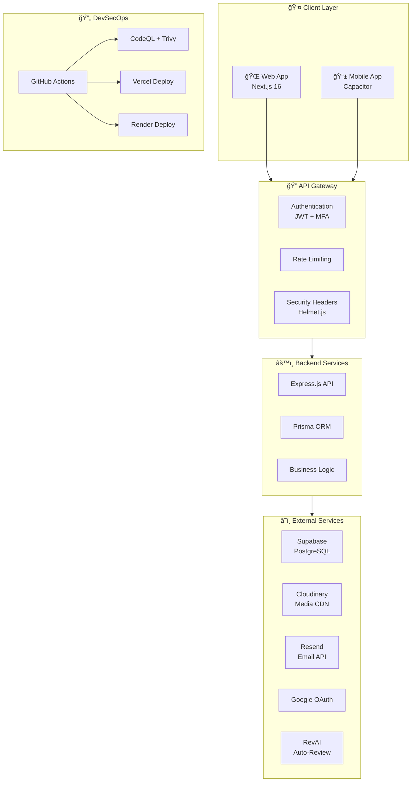
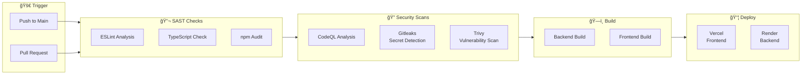
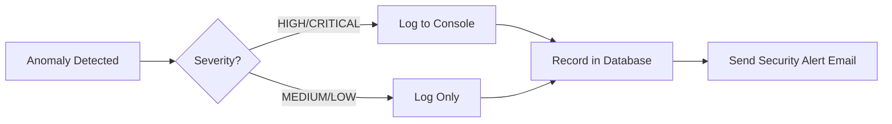

```mermaid
flowchart TD
    subgraph Input["📥 Login Event"]
        A["User Login Attempt"]
    end

    subgraph Analysis["🔍 Threat Analysis"]
        B["Extract User Agent & IP"]
        C["Generate Device Hash"]
        D{"Known Device?"}
        E["Check IP Failure History"]
        F{"5+ Failures?"}
        G["Check Login Time"]
        H{"2-5 AM?"}
    end

    subgraph Scoring["📊 Risk Scoring"]
        S1["+0 Points"]
        S2["+30 Points<br/>New Device"]
        S3["+25 Points<br/>Suspicious IP"]
        S4["+15 Points<br/>Unusual Time"]
        S5["Calculate Total<br/>Risk Score"]
    end

    subgraph Response["⚡ Response"]
        R1{"Score >= 50?"}
        R2["✅ Normal Login"]
        R3["⚠️ High Risk Alert"]
        R4["📧 Send Email Alert"]
        R5["📝 Log to Dashboard"]
    end

    A --> B --> C --> D
    D -->|Yes| S1
    D -->|No| S2
    S1 --> E
    S2 --> E
    E --> F
    F -->|No| G
    F -->|Yes| S3
    S3 --> G
    G --> H
    H -->|No| S5
    H -->|Yes| S4
    S4 --> S5
    S5 --> R1
    R1 -->|No| R2
    R1 -->|Yes| R3
    R3 --> R4
```

```mermaid
flowchart LR
    subgraph Request["📥 API Request"]
        A["Incoming Request"]
        B["Extract JWT Token"]
    end

    subgraph Validation["🔍 Zero-Trust Validation"]
        C{"Token Present?"}
        D{"Token Blacklisted?"}
        E{"Token Expired?"}
        F["Decode JWT Payload"]
        G{"User Active?"}
    end

    subgraph Device["📱 Device Check"]
        H["Generate Device Hash"]
        I{"Known Device?"}
        J["Register New Device"]
        K["Send Device Alert"]
    end

    subgraph Result["✅ Result"]
        R1["❌ 401 Unauthorized"]
        R2["❌ 403 Token Revoked"]
        R3["❌ 401 Token Expired"]
        R4["❌ 403 Account Disabled"]
        R5["✅ Access Granted"]
    end

    A --> B --> C
    C -->|No| R1
    C -->|Yes| D
    D -->|Yes| R2
    D -->|No| E
    E -->|Yes| R3
    E -->|No| F --> G
    G -->|No| R4
    G -->|Yes| H --> I
    I -->|Yes| R5
    I -->|No| J --> K --> R5
```

```mermaid
flowchart TD
    subgraph DataSources["📊 Data Sources"]
        D1["Login History"]
        D2["Security Alerts"]
        D3["User Devices"]
        D4["Failed Attempts"]
    end

    subgraph Processing["⚙️ Real-time Processing"]
        P1["Aggregate 24h Stats"]
        P2["Calculate Failure Rate"]
        P3["Identify High-Risk Users"]
        P4["Generate 7-Day Trends"]
    end

    subgraph Dashboard["📈 Admin Dashboard"]
        V1["Statistics Cards"]
        V2["Login History Table"]
        V3["Alert Feed"]
        V4["Trend Charts"]
        V5["At-Risk Users List"]
    end

    subgraph Actions["⚡ Admin Actions"]
        A1["Unlock Account"]
        A2["Investigate User"]
        A3["Export Report"]
        A4["View Device History"]
    end

    D1 --> P1
    D2 --> P1
    D3 --> P1
    D4 --> P1
    P1 --> P2
    P1 --> P3
    P1 --> P4
    P2 --> V1
    P3 --> V5
    P4 --> V4
    D1 --> V2
    D2 --> V3
    V5 --> A2
    V2 --> A1
    V3 --> A4
    V1 --> A3
```

```mermaid
flowchart LR
    subgraph Trigger["🚀 Trigger"]
        T1["Git Push"]
        T2["Pull Request"]
        T3["Schedule"]
    end

    subgraph SAST["🔬 SAST"]
        S1["ESLint"]
        S2["TypeScript"]
        S3["npm Audit"]
    end

    subgraph Security["🔐 Security"]
        SEC1["CodeQL"]
        SEC2["Gitleaks"]
        SEC3["Trivy"]
    end

    subgraph Gates["🚦 Quality Gates"]
        G1{"Critical Issues?"}
        G2{"Secrets Found?"}
        G3{"High CVEs?"}
    end

    subgraph Result["📋 Result"]
        R1["❌ Build Failed"]
        R2["✅ Build Passed"]
        R3["📊 Generate Report"]
        R4["🚀 Deploy"]
    end

    T1 --> SAST
    T2 --> SAST
    T3 --> Security
    SAST --> Security
    S1 --> G1
    SEC2 --> G2
    SEC3 --> G3
    G1 -->|Yes| R1
    G2 -->|Yes| R1
    G3 -->|Yes| R1
    G1 -->|No| G2
    G2 -->|No| G3
    G3 -->|No| R2
    R2 --> R3
    R3 --> R4
```

<h1 align="center">🏠 RentVerse (Secured by Vecna)</h1>
<p align="center"><i>A Secure Property Rental Platform with DevSecOps Integration</i></p>

<div align="center">
  <br>
  <b>UiTM Tapah</b>
  <br><br>
  <hr width="50%">
  <br>
  <br>
  <i>Building the Future Through Innovation</i>
  <br><br>
  <hr width="50%">
  <br>
  <br>
  <b>Team Vecna</b>
</div>

---

## 📋 Challenge Submission Details

| Field | Details |
|-------|---------|
| **Challenge** | Mobile SecOps 21 Days Challenge |
| **Organizer** | Metairflow R&D Sdn. Bhd. |
| **Team** | VECNA |
| **Institution** | UiTM Tapah |
| **Project Duration** | 27 November 2025 - 17 December 2025 |

---

## 👥 Team Vecna Members

<div align="center">
  <table>
    <tr>
      <td align="center" width="500">
        <br>
        <b>MOHAMAD BUKHARI BIN<br>AHMAD HUZAIRI</b><br>
        <code>2024916761</code><br>
        <sub>Backend & Cloud Infrastructure</sub>
      </td>
      <td align="center" width="500">
        <br>
        <b>MUHAMAD ZULKARNAIN BIN<br>SAMSUDIN</b><br>
        <code>2024793133</code><br>
        <sub>Frontend & Beta Tester</sub>
      </td>
      <td align="center" width=500">
        <br>
        <b>AQIL IMRAN BIN<br>NORHIDZAM</b><br>
        <code>2024779269</code><br>
        <sub>Security Lead</sub>
      </td>
    </tr>
  </table>
</div>

---

## 🔗 Quick Links

| Platform | Link |
|----------|------|
| 🌐 **Live Website** | [https://rentverse-frontend-nine.vercel.app/](https://rentverse-frontend-nine.vercel.app/) |
| 📱 **Mobile App (APK)** | [Download RentVerse APK](MobileAppBuild/rentverse-vecna.apk) |
| 📚 **API Docs** | [Swagger Documentation](/docs) |

### 🧪 Test Admin Account

> **Note**: MFA is disabled only for this specific account to allow testing of admin functionalities. For non-MFA accounts, you won't be greeted by the Welcome Popup Modal.

| Credential | Value |
|------------|-------|
| 📧 **Email** | `admin@rentverse.com` |
| 🔑 **Password** | `password123` |

> **⚠️ Important**: To test **user** and **landlord** functionalities, you must register with your own **real email address**. Fake emails will not work on this system (both Web and Mobile App) as OTP verification is required.

---

## 📸 Platform Preview

### Web Application
<!-- TODO: Add web-preview.png to github/assets/ -->
*Screenshot coming soon*

### Mobile Application
<!-- TODO: Add mobile-preview.png to github/assets/ -->
*Screenshot coming soon*

---

## 🛡️ Security Compliance Matrix

| Requirement ID | Security Module | Implementation Status | OWASP Alignment |
| :--- | :--- | :---: | :--- |
| **SEC-01** | **Multi-Factor Authentication** | ✅ Implemented | M2: Insecure Authentication |
| **SEC-02** | **API Rate Limiting** | ✅ Implemented | M4: Insufficient Input/Output Validation |
| **SEC-03** | **Data Encryption (At Rest)** | ✅ Implemented | M5: Insecure Data Storage |
| **SEC-04** | **Data Encryption (In Transit)** | ✅ Implemented | M3: Insecure Communication |
| **SEC-05** | **Input Sanitization** | ✅ Implemented | M7: Client Code Quality |
| **SEC-06** | **Audit Logging** | ✅ Implemented | M1: Improper Platform Usage |

---

## 📑 Table of Contents

| Section | Description |
|---------|-------------|
| [👥 Team Members](#-team-members) | Meet Team Vecna |
| [🔗 Quick Links](#-quick-links) | Live demo & download links |
| [📸 Platform Preview](#-platform-preview) | Web & Mobile screenshots |
| [📈 System Flow Diagrams](#-system-flow-diagrams) | Architecture & flow visualizations |
| [🔧 Development Platforms](#-development-platforms) | Hosting & services used |
| **🛡️ Core Development Modules** | |
| [🟢 Module 1: Secure Login & MFA](#-module-1-secure-login--mfa-) | Authentication & Authorization |
| [🔵 Module 2: Secure API Gateway](#-module-2-secure-api-gateway-) | HTTPS, JWT, Rate Limiting |
| [🟣 Module 3: Sensitive Data Handling](#-module-3-sensitive-data-handling-) | Encryption & Secure Storage |
| [🟠 Module 4: Secure Session Management](#-module-4-secure-session-management-) | Token Lifecycle & Blacklisting |
| [🩷 Module 5: Input Validation & Defense](#-module-5-input-validation--defense-) | XSS, SQL Injection Prevention |
| [🔷 Module 6: DevSecOps Integration](#-module-6-devsecops-integration-) | CI/CD Security Pipeline |
| **🚀 Feature Innovation Pool** | |
| [🟡 Category 1: Threat Intelligence](#-category-1-threat-intelligence-system-️) | Risk scoring & pattern detection |
| [🟪 Category 2: Zero-Trust Access](#-category-2-zero-trust-access-logic-) | Device verification & session control |
| [🟩 Category 3: Adaptive Defense](#-category-3-adaptive-defense-dashboard-) | Security monitoring dashboard |
| [🟫 Category 4: Automated Testing](#-category-4-automated-security-testing-) | CI/CD security scanning |
| **✨ Special Features** | |
| [📝 Digital Rental Agreements](#-digital-rental-agreements) | E-signatures & PDF generation |
| [🔐 OTP-Based Password Reset](#-otp-based-password-reset) | Secure password recovery |
| [📧 Smart Email Notifications](#-smart-email-notification-system) | Responsive email templates |
| [👑 Admin Dashboard](#-admin-dashboard) | Platform administration |
| [📱 Mobile Application](#-mobile-application) | Android app with Capacitor |
| [📅 Booking & Viewing System](#-booking--viewing-system) | Property scheduling |
| [🛠️ Technology Stack](#️-technology-stack) | Backend, Frontend & DevOps tools |
| [📚 API Documentation](#-api-documentation) | Swagger UI endpoints |
| [⚖️ IP & Legal](#-intellectual-property--ownership) | Ownership & Compliance |

---

## 📈 System Flow Diagrams

### 🏗️ System Architecture Overview



### 🔐 Authentication Flow (MFA/OTP)

```mermaid
sequenceDiagram
    participant U as 👤 User
    participant F as 🌐 Frontend
    participant A as 🔐 Auth API
    participant D as 🗄️ Database
    participant E as 📧 Email Service

    U->>F: Enter email & password
    F->>A: POST /auth/login
    A->>D: Verify credentials
    
    alt Invalid Credentials
        A-->>F: 401 Unauthorized
        A->>D: Log failed attempt
        D-->>A: Check attempt count
        alt 5+ Failed Attempts
            A->>E: Send notification to admin
        end
    else Valid Credentials
        A->>D: Check MFA status
        alt MFA Enabled
            A->>A: Generate 6-digit OTP
            A->>D: Store hashed OTP
            A->>E: Send OTP email
            A-->>F: Require OTP verification
            U->>F: Enter OTP code
            F->>A: POST /auth/verify-otp
            A->>D: Verify OTP hash
            alt Valid OTP
                A->>D: Log successful login
                A->>D: Register device
                A-->>F: Return JWT token
            else Invalid OTP
                A-->>F: 401 Invalid OTP
            end
        else MFA Disabled
            A->>D: Log successful login
            A-->>F: Return JWT token
        end
    end
```



### 🏠 Property Listing & Approval Flow

```mermaid
flowchart TD
    subgraph Landlord["🏠 Landlord Actions"]
        L1["Create Property Listing"]
        L2["Choose Property Type"]
        L3["Select Location Inide Map"]
        L4["Fill in Details Address"]
        L5["Enter Property Details"]
        L6["Upload Property Images"]
        L7["Input Property Name"]
        L8["Add Property Description"]
        L9["Submit & Save"]
    end

    subgraph System["⚙️ System Processing"]
        S1{"Auto-Review<br/>Enabled?"}
        S2["RevAI Analysis"]
        S3["Flag for<br/>Manual Review"]
        S4["Create Pending<br/>Approval Record"]
    end

    subgraph Admin["👑 Admin Review"]
        A1["View Pending Properties"]
        A2["Review Details"]
        A3{"Decision"}
        A4["✅ Approve"]
        A5["❌ Reject"]
    end

    subgraph Result["📋 Result"]
        R1["Property Live<br/>on Platform"]
        R2["Notify Landlord<br/>Approved"]
        R3["Notify Landlord<br/>Rejected"]
        R4["Property Hidden"]
    end

    L1 --> L2 --> L3 --> L4
    L4 --> S1
    S1 -->|Yes| S2
    S1 -->|No| S4
    S2 -->|Pass| A4
    S2 -->|Fail/Uncertain| S3
    S3 --> S4
    S4 --> A1
    A1 --> A2 --> A3
    A3 -->|Approve| A4
    A3 -->|Reject| A5
    A4 --> R1 --> R2
    A5 --> R4 --> R3
```



### 📝 Digital Agreement Signing Flow


### 🛡️ Security Monitoring Flow


### 🔄 CI/CD Security Pipeline



---

## 🔧 Development Platforms

<div align="center">
  <table>
    <tr>
      <td align="center" width="120">
        <br>
        <b>Vercel</b><br>
        <sub>Frontend Hosting</sub>
      </td>
      <td align="center" width="120">
        <br>
        <b>Render</b><br>
        <sub>Backend Hosting</sub>
      </td>
      <td align="center" width="120">
        <br>
        <b>Supabase</b><br>
        <sub>PostgreSQL Database</sub>
      </td>
      <td align="center" width="120">
        <br>
        <b>Resend</b><br>
        <sub>Email Service</sub>
      </td>
    </tr>
    <tr>
      <td align="center" width="120">
        <br>
        <b>Capacitor</b><br>
        <sub>Mobile App</sub>
      </td>
      <td align="center" width="120">
        <br>
        <b>Google OAuth</b><br>
        <sub>Authentication</sub>
      </td>
      <td align="center" width="120">
        <br>
        <b>Cloudinary</b><br>
        <sub>Media Storage</sub>
      </td>
      <td align="center" width="120">
        <br>
        <b>MapTiler</b><br>
        <sub>Maps & Geocoding</sub>
      </td>
    </tr>
    <tr>
      <td align="center" width="120">
        <br>
        <b>GitHub Actions</b><br>
        <sub>CI/CD Pipeline</sub>
      </td>
      <td align="center" width="120">
        <br>
        <b>Prisma</b><br>
        <sub>ORM</sub>
      </td>
      <td align="center" width="120">
        <br>
        <b>Node.js</b><br>
        <sub>Runtime</sub>
      </td>
      <td align="center" width="120">
        <br>
        <b>Next.js</b><br>
        <sub>React Framework</sub>
      </td>
    </tr>
  </table>
</div>

---

## 🛡️ Core Development Modules (Module 1-6)

> **Technical Documentation** - All security modules implemented based on actual codebase analysis.

### 🟢 Module 1: Secure Login & MFA 🔐

**Description:** Role-based MFA/OTP login with device verification and suspicious activity detection.  
**Security Focus:** Authentication & Authorization (OWASP M1–M3)  
**Key Files:** `src/services/enhancedMFA.service.js`, `src/services/fastOTPService.js`

#### Role-Based MFA Policies

| Role | MFA Required | Session Timeout | Max Failed Attempts | Login Hours | Device Verification |
|------|--------------|-----------------|---------------------|-------------|---------------------|
| **ADMIN** | ✅ Yes | 15 min | 3 attempts | 6 AM - 10 PM | ✅ Required |
| **LANDLORD** | ✅ Yes | 30 min | 5 attempts | 5 AM - 11 PM | ✅ Required |
| **USER** | ❌ Optional | 60 min | 5 attempts | 24/7 | ❌ Optional |

```javascript
// Role-Based MFA Policy Configuration (enhancedMFA.service.js)
roleBasedMFAPolicies = {
  ADMIN: {
    requireMFA: true,
    allowedMethods: ['TOTP', 'SMS', 'EMAIL'],
    sessionTimeout: 15, // minutes
    maxFailedAttempts: 3,
    allowedLoginHours: { start: 6, end: 22 },
    requireDeviceVerification: true
  },
  LANDLORD: {
    requireMFA: true,
    allowedMethods: ['TOTP', 'EMAIL'],
    sessionTimeout: 30,
    maxFailedAttempts: 5,
    requireDeviceVerification: true
  },
  USER: {
    requireMFA: false,
    sessionTimeout: 60,
    requireDeviceVerification: false
  }
};
```

#### Multi-Factor Authentication Features

| Feature | Implementation |
|---------|----------------|
| **OTP Generation** | Speakeasy TOTP with 5-minute step window |
| **OTP Delivery** | Parallel email + SMS delivery via `fastOTPService.js` |
| **TOTP Authenticator** | QR code generation for Google Authenticator |
| **Backup Codes** | 10 recovery codes generated on MFA setup |
| **Expiry** | Role-based (15-60 minutes based on user role) |

#### Fast OTP Service (`fastOTPService.js`)

```javascript
// High-performance OTP with parallel delivery
async sendOTP(email, otp, options = {}) {
  const deliveryPromises = [];
  
  // Email delivery (primary)
  deliveryPromises.push(this.sendOTPEmail(email, otp, deliveryId));

  // SMS delivery (backup, if configured)
  if (this.smsProvider && options.sendSMS) {
    deliveryPromises.push(this.sendOTPSMS(phoneNumber, otp, deliveryId));
  }

  // Wait for all delivery methods in parallel
  const deliveryResults = await Promise.all(deliveryPromises);
  return { success: deliveryResults.filter(r => r.success).length > 0 };
}
```

#### Suspicious Activity Detection

```javascript
// Risk score calculation for login attempts
async detectSuspiciousActivity(user) {
  let riskScore = 0;
  let reasons = [];

  // Failed attempts check (+0.3)
  if (user.loginAttempts > 0) {
    riskScore += 0.3;
    reasons.push('Previous failed attempts');
  }

  // Rapid successive logins (+0.2)
  const hoursSinceLastLogin = (Date.now() - user.lastLoginAt) / (1000 * 60 * 60);
  if (hoursSinceLastLogin < 1) {
    riskScore += 0.2;
    reasons.push('Rapid successive login attempts');
  }

  // Outside normal hours (+0.4)
  if (currentHour < policy.allowedLoginHours.start) {
    riskScore += 0.4;
    reasons.push('Login outside normal hours');
  }

  // Block if risk score > 0.8
  return { riskScore, blocked: riskScore > 0.8, reasons };
}
```

| Risk Factor | Points Added | Description |
|-------------|--------------|-------------|
| Previous Failed Attempts | +0.3 | User has failed login attempts |
| Rapid Logins | +0.2 | Login within 1 hour of last attempt |
| Outside Normal Hours | +0.4 | Login outside configured hours |
| **Block Threshold** | **> 0.8** | User login blocked |

#### Account Lockout

| Feature | Value |
|---------|-------|
| Max Attempts | Role-based (3 for ADMIN, 5 for others) |
| Lockout Duration | 15 minutes |
| Notification | Security alert email sent |


##### 🔄 MFA Toggle (User-Controlled)
- **Enable MFA:** One-click enable from Security Settings
- **Disable MFA:** Requires password confirmation for security
- **Real-time Status:** Visual indicator shows current MFA status
- **Email Notification:** Users receive email when MFA status changes

**Key Files:**
- `app/account/security/page.tsx` - MFA toggle UI component
- `auth.js` - `/mfa/enable` and `/mfa/disable` endpoints

---

### 🔵 Module 2: Secure API Gateway 🔒

**Description:** Multi-tier rate limiting, security headers, and request validation.  
**Security Focus:** Secure Communication (OWASP M5–M6)  
**Key Files:** `src/middleware/rateLimiter.js`, `src/middleware/security.js`

#### Multi-Tier Rate Limiting (`rateLimiter.js`)

| Limiter Type | Limit | Window | Purpose |
|--------------|-------|--------|---------|
| **General** | 100 requests | 15 min | Standard API protection |
| **Login** | 5 attempts | 15 min | Brute force prevention |
| **Register** | 3 attempts | 1 hour | Registration abuse |
| **OTP** | 3 requests | 10 min | OTP flooding prevention |
| **Admin** | 50 requests | 15 min | Admin endpoint protection |
| **Upload** | 10 uploads | 1 hour | File upload control |
| **Search** | 200 requests | 15 min | Search abuse prevention |
| **Password Reset** | 3 requests | 1 hour | Reset abuse prevention |

```javascript
// Rate Limiter Configuration (rateLimiter.js)
const rateLimiters = {
  general: createRateLimiter({ windowMs: 15 * 60 * 1000, max: 100 }),
  login: createRateLimiter({ windowMs: 15 * 60 * 1000, max: 5, skipSuccessfulRequests: true }),
  otp: createRateLimiter({ windowMs: 10 * 60 * 1000, max: 3 }),
  admin: createRateLimiter({ windowMs: 15 * 60 * 1000, max: 50 }),
  upload: createRateLimiter({ windowMs: 60 * 60 * 1000, max: 10 }),
  passwordReset: createRateLimiter({ windowMs: 60 * 60 * 1000, max: 3 })
};
```

#### Security Middleware Stack (`security.js`)

| Middleware | Purpose |
|------------|---------|
| **Helmet.js** | Security headers (XSS, CSP, HSTS, frame protection) |
| **HTTPS Enforcement** | Redirect HTTP to HTTPS for secure paths |
| **XSS Protection** | Null byte removal from request bodies |
| **SQL Injection Detection** | Pattern-based detection with logging |
| **CORS Config** | Allowlist-based origin validation |
| **Request Size Limit** | 10MB maximum request size |

```javascript
// Content Security Policy (security.js)
const securityHeaders = helmet({
  contentSecurityPolicy: {
    directives: {
      defaultSrc: ["'self'"],
      scriptSrc: ["'self'", "'unsafe-inline'", "https://cdn.jsdelivr.net"],
      styleSrc: ["'self'", "'unsafe-inline'", "https://fonts.googleapis.com"],
      imgSrc: ["'self'", "data:", "https:", "blob:"],
      connectSrc: ["'self'", "https:", "wss:"],
      frameSrc: ["'none'"],
      objectSrc: ["'none'"]
    }
  }
});

// SQL Injection Detection
const sqlInjectionProtection = (req, res, next) => {
  const dangerousPatterns = [
    /(\%27)|(\')|(--)|(\%23)|(#)/gi,
    /\w*((\%27)|(\'))union[^\w]*((\%27)|(\'))/gi
  ];
  
  if (checkForSQL(req.body)) {
    console.log(`🚨 SQL Injection attempt from IP: ${req.ip}`);
    return res.status(400).json({ message: 'Invalid request format' });
  }
  next();
};
```

#### CORS Configuration

```javascript
const corsOptions = {
  origin: ['http://localhost:3000', 'http://localhost:3001', 
           'https://rentverse-frontend.vercel.app'],
  credentials: true,
  methods: ['GET', 'POST', 'PUT', 'DELETE', 'PATCH', 'OPTIONS'],
  allowedHeaders: ['Content-Type', 'Authorization', 'X-CSRF-Token', 'X-API-Key'],
  exposedHeaders: ['X-RateLimit-Limit', 'X-RateLimit-Remaining', 'X-RateLimit-Reset'],
  maxAge: 86400 // 24 hours
};
```

---

### 🟣 Module 3: Digital Agreement 📝

**Description:** JWT-based digital signatures with replay attack prevention and document integrity verification.  
**Security Focus:** Data Integrity & Workflow Validation  
**Key Files:** `src/services/digitalSignatureValidation.js`, `src/services/pdfGeneration.service.js`

#### Digital Signature System (`digitalSignatureValidation.js`)

| Feature | Implementation |
|---------|----------------|
| **JWT Signatures** | Cryptographic signing with 24-hour expiry |
| **Nonce Generation** | 16-byte random nonce prevents replay attacks |
| **Document Hash** | SHA-256 with secret salt for integrity |
| **Permission Check** | Validates user access (owner, tenant, or signer) |

```javascript
// Generate Signature Payload (digitalSignatureValidation.js)
generateSignaturePayload(documentId, userId, userRole, documentHash) {
  const timestamp = Date.now();
  const nonce = crypto.randomBytes(16).toString('hex');
  
  const payload = {
    documentId, userId, userRole, documentHash,
    timestamp, nonce, version: '1.0'
  };

  // Create JWT signature for tamper-proof verification
  const signature = jwt.sign(payload, process.env.JWT_SECRET, {
    expiresIn: '24h',
    issuer: 'rentverse-dsa'
  });

  return { payload, signature, expiresAt: new Date(timestamp + 24*60*60*1000) };
}
```

#### Replay Attack Prevention

```javascript
// Validate signature and prevent reuse (digitalSignatureValidation.js)
async validateSignature(signature, documentId, userId) {
  const decoded = jwt.verify(signature, process.env.JWT_SECRET);

  // Check for existing signature with same nonce (replay attack)
  const existingSignature = await prisma.digitalSignature.findFirst({
    where: {
      documentId, userId,
      nonce: decoded.nonce,
      createdAt: { gte: new Date(Date.now() - 10 * 60 * 1000) } // Last 10 min
    }
  });

  if (existingSignature) {
    throw new Error('Signature already used - potential replay attack');
  }

  return { valid: true, user: decoded.userId, timestamp: decoded.timestamp };
}
```

#### PDF Generation with Document Hashing (`pdfGeneration.service.js`)

```javascript
// Generate and sign rental agreement PDF
async generateAndUploadRentalAgreementPDF(leaseId) {
  // 1. Get lease data with property, tenant, landlord info
  const lease = await prisma.lease.findUnique({ where: { id: leaseId }, include: {...} });

  // 2. Render HTML template with EJS
  const html = ejs.render(templateContent, templateData);

  // 3. Generate PDF with Puppeteer
  const browser = await puppeteer.launch({ headless: true, args: ['--no-sandbox'] });
  const pdfBuffer = await page.pdf({ format: 'A4', printBackground: true });

  // 4. � Create SHA-256 document hash for digital signature
  const digitalSignature = generateDocumentHash(pdfBuffer);
  console.log(`✅ Document Secured. SHA-256 Hash: ${digitalSignature}`);

  // 5. Save to database with signature
  await prisma.rentalAgreement.create({
    data: {
      leaseId, pdfUrl, fileName, fileSize,
      digitalSignature,  // SHA-256 hash
      signedAt: new Date()
    }
  });
}
```

#### Signature Audit Trail

| Field | Description |
|-------|-------------|
| `signatureHash` | SHA-256 hash of the JWT signature |
| `nonce` | Unique random value for replay prevention |
| `ipAddress` | Signer's IP address |
| `userAgent` | Signer's browser/device info |
| `status` | PENDING, SIGNED, REJECTED |
| `metadata` | Role, timestamp, version info |

---

### 🟠 Module 4: Smart Notification & Alert System 🔔

**Description:** AI-powered security anomaly detection with automated alert system.  
**Security Focus:** DevSecOps Monitoring & Incident Detection  
**Key Files:** `src/services/securityAnomalyDetection.js`, `src/services/enhancedEmailService.js`

#### Security Anomaly Detection (`securityAnomalyDetection.js`)

| Anomaly Type | Severity | Trigger | Auto-Alert |
|--------------|----------|---------|------------|
| `FAILED_LOGIN` | HIGH | 5+ failed OTP attempts in 15 min | ✅ Yes |
| `MULTIPLE_FAILED_LOGINS` | HIGH | 3+ failed logins in 15 min | ✅ Yes |
| `UNUSUAL_ACCESS_TIME` | MEDIUM | Login outside 11 PM - 6 AM | ❌ Log only |
| `MULTIPLE_SESSIONS` | MEDIUM | Multiple logins within 5 min | ❌ Log only |
| `API_ABUSE` | HIGH | Rate limit breaches | ✅ Yes |
| `BRUTE_FORCE` | CRITICAL | Sustained attack pattern | ✅ Yes |

#### Anomaly Thresholds Configuration

```javascript
// Security Anomaly Thresholds (securityAnomalyDetection.js)
anomalyThresholds = {
  failedLogins: 3,           // Failed logins before flagging
  failedOTPs: 5,             // Failed OTP attempts before flagging
  unusualHours: { start: 23, end: 6 },  // 11 PM - 6 AM
  locationChangeThreshold: 100,  // KM difference for location change
  apiRateLimitBreaches: 5,   // Rate limit hits
  sessionDuration: { min: 300, max: 28800 }  // 5 min to 8 hours
};
```

#### AI-Powered Pattern Analysis

```javascript
// AI Service Integration for Anomaly Detection
async analyzeWithAI(userData) {
  const response = await axios.post(`${this.aiServiceUrl}/api/v1/anomaly/detect`, {
    user_id: userData.userId,
    user_email: userData.userEmail,
    user_role: userData.userRole,
    ip_address: userData.ipAddress,
    user_agent: userData.userAgent,
    login_success: userData.success,
    recent_activity: userData.recentActivity,  // Last 24 hours
    analysis_type: 'security'
  });
  return response.data;
}
```

#### Anomaly Recording & Resolution

```javascript
// Record anomalies to database
await prisma.securityAnomaly.createMany({
  data: anomalies.map(anomaly => ({
    userId, type: anomaly.type,
    severity: anomaly.severity,
    description: anomaly.description,
    ipAddress, userAgent,
    metadata: anomaly.metadata,
    resolved: false  // Requires admin resolution
  }))
});

// Admin can resolve anomalies
await prisma.securityAnomaly.update({
  where: { id: anomalyId },
  data: { resolved: true, resolvedAt: new Date() }
});
```

#### High Severity Alert Workflow



---

### 🔴 Module 5: Activity Log Dashboard 📊

**Description:** Provide admin-level logs for failed logins and critical actions.  
**Security Focus:** Threat Visualization & Accountability

#### Implementation Details

##### 📈 Dashboard Statistics

| Metric | Description |
|--------|-------------|
| 24h Login Metrics | Total, successful, failed logins |
| OAuth vs Email | Breakdown of login methods |
| High Risk Logins | Logins with risk score ≥50 |
| Locked Accounts | Currently locked user accounts |
| 7-Day Trends | Daily login success/failure charts |

**Key Files:** `src/routes/admin.security.routes.js` - Admin security API endpoints

```javascript
// Statistics Endpoint
GET /api/admin/security/statistics
Response: {
    totalLogins24h, failedLogins24h, successfulLogins24h,
    highRiskLogins24h, alertsSent24h, newDevices24h,
    oauthLogins24h, emailLogins24h, lockedAccounts,
    failureRate, trends: { daily: [...] }
}
```

##### 📋 Login History
- **Paginated View:** Browse all login attempts
- **Filters:** By success/failure, high risk, user
- **Details:** IP address, device type, browser, OS, risk score

##### 🔍 User Investigation
- **Per-User History:** View specific user's login activity
- **Device Management:** See registered devices per user
- **Alert History:** User's security alerts

---

### 🔷 Module 6: CI/CD Security Testing (Bonus) ⚙️

**Description:** Automated security scanning pipeline with multi-tool analysis.  
**Security Focus:** Continuous Testing (DevSecOps)  
**Workflow File:** `.github/workflows/security-scan.yml`

#### Security Scanning Pipeline

```yaml
# .github/workflows/security-scan.yml
name: 🛡️ Security Testing (SAST) - Module 6

on:
  push:
    branches: [ main, develop ]
  pull_request:
    branches: [ main ]

jobs:
  security-scan:
    runs-on: ubuntu-latest
    steps:
      - name: 📁 Checkout code
      - name: 🔧 Setup Node.js 18
      - name: 🔧 Setup Python 3.9
      - name: 📦 Install dependencies (npm ci + pip)
      - name: 🔍 Run Bandit (Python SAST)
      - name: 🔍 Run Semgrep (JavaScript/TypeScript SAST)
      - name: 🔍 Run CodeQL Analysis
      - name: 🚫 Dependency Security Audit (npm audit + Safety)
      - name: 🔑 Secret Detection (TruffleHog)
      - name: 📊 Upload Security Reports
      - name: ✅ Security Gate Check
```

#### Security Tools Matrix

| Tool | Purpose | Language | Report |
|------|---------|----------|--------|
| **Bandit** | Python SAST security linter | Python | JSON/TXT |
| **Semgrep** | Multi-language SAST scanner | JS/TS | SARIF |
| **CodeQL** | Semantic code analysis | JS/Python | SARIF |
| **npm audit** | Node.js dependency vulnerabilities | Node.js | Console |
| **Safety** | Python package vulnerabilities | Python | JSON |
| **TruffleHog** | Secret/credential detection | All | Console |

#### Semgrep Rule Sets

```yaml
# Configured rule sets for comprehensive coverage
config: >-
  p/security-audit
  p/secrets
  p/owasp-top-ten
  p/javascript
  p/typescript
```

#### Security Gate Summary

```bash
# Generated in GITHUB_STEP_SUMMARY
## 🛡️ Security Scan Results

### ✅ Completed Security Checks:
- Bandit (Python SAST)
- Semgrep (JavaScript/TypeScript SAST)
- CodeQL (Semantic Analysis)
- Dependency Audit (npm audit)
- Safety Check (Python packages)
- Secret Detection

### 🎯 Module 6 Status: **COMPLETE**

**All 6 Security Modules Now Implemented:**
1. ✅ Secure Login & MFA
2. ✅ Secure API Gateway
3. ✅ Digital Agreement (Mobile)
4. ✅ Smart Notification & Alert System
5. ✅ Activity Log Dashboard
6. ✅ **CI/CD Security Testing** ← **IMPLEMENTED**
```

---

## 🚀 Feature Innovation Pool (Category 1-4)

*Additional advanced security features implemented beyond core modules.*

### 🟡 Category 1: Threat Intelligence System 🛡️

**Description:** A rule-based module that detects unusual access patterns, repeated failed logins, and potential intrusion attempts through intelligent pattern analysis.

#### Flow Diagram



#### Implementation Details

**Risk Score Calculation** (`suspiciousActivity.service.js`):

```javascript
// Dynamic risk scoring based on multiple factors
async function calculateRiskScore(userId, ipAddress, userAgent) {
    let riskScore = 0;
    
    // New device detection (+30 points)
    const deviceHash = generateDeviceHash(userAgent, ipAddress);
    const knownDevice = await prisma.userDevice.findFirst({
        where: { userId, deviceHash },
    });
    if (!knownDevice) riskScore += 30;
    
    // IP failure history (+25 points if >5 failures)
    const ipFailures = await prisma.loginHistory.count({
        where: {
            ipAddress,
            success: false,
            createdAt: { gte: new Date(Date.now() - 60 * 60 * 1000) },
        },
    });
    if (ipFailures > 5) riskScore += 25;
    
    return Math.min(riskScore, 100);
}
```

**Suspicious Pattern Detection:**

| Pattern Type | Detection Criteria | Severity |
|--------------|-------------------|----------|
| Multiple Failures | 3+ failures in 5 minutes | High |
| Geographic Anomaly | Logins from 3+ IPs in 1 hour | Medium |
| Unusual Timing | Logins between 2-5 AM | Low |
| Brute Force | 5 failed attempts → account lock | Critical |

**Key Files:**
- `suspiciousActivity.service.js` - Pattern detection & risk scoring
- `otp.service.js` - Failed attempt tracking & account lockout
- `apiLogger.js` - Security event logging

---

### 🟪 Category 2: Zero-Trust Access Logic 🔐

**Description:** Implements conditional access controls including device verification, automatic token invalidation, and comprehensive session management.

#### Flow Diagram



#### Implementation Details

**Device Fingerprinting & Tracking** (`suspiciousActivity.service.js`):

```javascript
// Generate unique device hash from user agent + IP
function generateDeviceHash(userAgent, ipAddress) {
    const data = `${userAgent || 'unknown'}-${ipAddress || 'unknown'}`;
    return crypto.createHash('sha256').update(data).digest('hex').substring(0, 32);
}

// Register and track devices per user
async function checkDevice(userId, userAgent, ipAddress) {
    const deviceHash = generateDeviceHash(userAgent, ipAddress);
    
    const existingDevice = await prisma.userDevice.findFirst({
        where: { userId, deviceHash },
    });
    
    if (!existingDevice) {
        // Alert user about new device login
        return { isNew: true, device: await registerNewDevice() };
    }
    return { isNew: false, device: existingDevice };
}
```

**Token Blacklist System** (`tokenBlacklist.js`):
- Immediate token invalidation on logout
- Automatic cleanup of expired tokens every hour
- User-wide token revocation capability
- Statistics tracking for security monitoring

**Zero-Trust Features:**

| Feature | Implementation | OWASP Alignment |
|---------|---------------|-----------------|
| New Device Alerts | Email + Security Alert | M1, M3 |
| Token Blacklisting | In-memory with cleanup | M6 |
| Session Validation | JWT expiry + blacklist check | M1 |
| User-Agent Tracking | SHA-256 fingerprinting | M3 |

---

### 🟩 Category 3: Adaptive Defense Dashboard 💻

**Description:** An interactive admin dashboard that visualizes system risk levels and auto-responds to flagged security events with automated countermeasures.

#### Flow Diagram



#### Implementation Details

**Security Statistics API** (`admin.security.routes.js`):

```javascript
// Real-time security metrics
const statistics = {
    totalLogins24h,
    failedLogins24h,
    successfulLogins24h,
    highRiskLogins24h,      // Risk score >= 50
    alertsSent24h,
    newDevices24h,
    uniqueUsers24h,
    lockedAccounts,         // Currently locked
    oauthLogins24h,         // Google, Facebook, etc.
    emailLogins24h,
    failureRate: Math.round((failedLogins24h / totalLogins24h) * 100),
};
```

**Auto-Response Mechanisms:**

| Trigger | Automatic Response | Notification |
|---------|-------------------|--------------|
| 5 Failed Logins | Account locked 15 min | Email + Alert |
| High Risk Login | Security alert created | Email |
| New Device | Device registered + alert | Email |
| Multiple IPs | Suspicious activity flag | Dashboard |

**Users at Risk Tracking:**

```javascript
// Identify high-risk users automatically
const usersWithHighRisk = await prisma.loginHistory.groupBy({
    by: ['userId'],
    where: {
        createdAt: { gte: last24h },
        riskScore: { gte: 50 },
    },
    _count: true,
});
```

**Dashboard Features:**
- 7-day login trend visualization
- Alert type distribution charts
- Top 20 at-risk users list
- User investigation with full history
- One-click account unlock capability

---

### 🟫 Category 4: Automated Security Testing 🧪

**Description:** Integrated security scanning tools in the CI/CD pipeline that run automatically before each deployment to catch vulnerabilities early.

#### Flow Diagram



#### Implementation Details

**GitHub Actions Security Workflow** (`.github/workflows/security-scan.yml`):

| Tool | Purpose | Integration |
|------|---------|-------------|
| ESLint | Static code analysis | Every PR/push |
| TypeScript | Type safety verification | Every PR/push |
| npm audit | Dependency vulnerabilities | Every PR/push |
| CodeQL | Advanced security analysis | Every PR/push |
| Gitleaks | Secret detection | Every PR/push |
| Trivy | Container/dependency scan | Every PR/push |

**Pipeline Configuration:**

```yaml
# Security scanning on every push
jobs:
  backend-sast:
    - npm audit --audit-level=moderate
    - npx eslint src/ --max-warnings 0
    
  secret-detection:
    - gitleaks detect --source . --verbose
    
  dependency-scan:
    - trivy fs . --severity HIGH,CRITICAL
    
  codeql-analysis:
    - github/codeql-action/analyze
```

**Security Gates:**
- ❌ Build fails on HIGH/CRITICAL vulnerabilities
- ❌ Build fails on detected secrets
- ❌ Build fails on critical ESLint errors
- ✅ Security report generated for each run

**Current Pipeline Status:**

| Check | Status |
|-------|--------|
| Backend SAST | ✅ Active |
| Frontend SAST | ✅ Active |
| Secret Detection | ✅ Active |
| Dependency Scan | ✅ Active |
| CodeQL Analysis | ✅ Active |

---

## ✨ Special Features

*Beyond the core security modules, RentVerse includes these unique features that enhance the rental experience.*

### 📝 Digital Rental Agreements

Complete digital agreement workflow with legally-binding electronic signatures.

| Feature | Description |
|---------|-------------|
| 🔏 E-Signatures | Canvas-based signature capture with SHA-256 hashing |
| 📄 PDF Generation | Automated lease contract generation with Puppeteer |
| ✅ Dual-Party Signing | Landlord signs first, then tenant counter-signs |
| 📊 Audit Trail | Complete history of all agreement actions |
| 🔐 Document Integrity | Hash verification ensures no tampering |
| ☁️ Cloud Storage | PDFs stored securely on Cloudinary |

**Signing Workflow:**
```
1. Landlord creates lease → PDF generated
2. Landlord signs → Signature hash stored
3. Tenant notified → Signs agreement
4. Both signatures → Agreement activated
5. Both parties receive final PDF
```

**Key Files:**
- `digitalAgreement.service.js` - Workflow & signature validation
- `pdfGeneration.service.js` - Puppeteer PDF generation
- `eSignature.service.js` - Canvas signature handling
- `agreement.routes.js` - Agreement API endpoints

---

### 🔐 OTP-Based Password Reset

Secure forgot password flow with email OTP verification.

**Security Features:**
- ✅ Rate-limited requests (3/minute)
- ✅ OTP expires in 5 minutes
- ✅ Reset token expires in 5 minutes
- ✅ Password strength requirements enforced
- ✅ Confirmation email on password change
- ✅ Generic responses prevent email enumeration

**Flow:**
```
1. User enters email → OTP sent
2. User enters OTP → Verified
3. User sets new password → Updated
4. Confirmation email sent
```

**Key Files:**
- `auth.js` - `/forgot-password/*` endpoints
- `email.service.js` - Password reset email templates
- `app/auth/forgot-password/page.tsx` - Frontend UI

---

### 📧 Smart Email Notification System

Beautiful, responsive email templates for all platform events.

**Email Types:**

| Email | Trigger |
|-------|---------|
| 🔐 Login OTP | MFA verification during login |
| 🔑 Password Reset OTP | Forgot password request |
| ✅ Password Changed | After password update |
| 🛡️ MFA Enabled | When user enables 2FA |
| ⚠️ Security Alert | Suspicious activity detected |
| 📝 Agreement Ready | When lease is ready to sign |
| ✅ Agreement Signed | Confirmation of signatures |

**Features:**
- 📱 Mobile-responsive HTML templates
- 🎨 Branded with RentVerse colors
- 📧 Works with Gmail, Outlook, Apple Mail
- 🔄 Fallback plain text for all emails

---

### 👑 Admin Dashboard

Comprehensive administration panel for platform management.

| Module | Capabilities |
|--------|--------------|
| 👥 User Management | View, suspend, delete users |
| 🏠 Property Moderation | Approve, reject, feature listings |
| 📝 Agreement Oversight | View all agreements, download PDFs |
| 🔒 Security Logs | View login attempts, security events |

**Access Control:**
- Only users with `role: ADMIN` can access
- Protected API routes with role middleware
- Audit logging for all admin actions

**Key Files:**
- `admin.users.routes.js` - User management
- `admin.properties.routes.js` - Property moderation
- `admin.agreements.routes.js` - Agreement oversight
- `admin.security.routes.js` - Security logs
- `app/admin/*` - Admin frontend pages

---

### 📱 Mobile Application

Native Android app built with Capacitor for on-the-go access.

**Features:**
- 🔗 Deep linking to properties
- 🔔 Push notification ready
- 📷 Property photo viewing
- 🔐 Full authentication support
- 📝 View and manage agreements

**Download:** [RentVerse APK](MobileAppBuild/rentverse-vecna.apk)

**Key Files:**
- `MobileAppIntegration/` - Mobile configuration docs
- `capacitor.config.ts` - Capacitor configuration
- `android/` - Android native project

---

### 📅 Booking & Viewing System

Schedule property viewings with landlords.

**Features:**
- Select available time slots
- Request property viewings
- Landlord approval workflow
- Email notifications for both parties

**Key Files:**
- `modules/bookings/` - Booking backend
- `app/property/[id]/booking/` - Booking UI

---

## 🛠️ Technology Stack

<div align="center">

### 🖥️ Backend Technologies

<table>
  <tr>
    <td align="center" width="100">
      <br>
      <b>Node.js</b><br>
      <sub>v20+ Runtime</sub>
    </td>
    <td align="center" width="100">
      <br>
      <b>Express.js</b><br>
      <sub>v4.18 Framework</sub>
    </td>
    <td align="center" width="100">
      <br>
      <b>PostgreSQL</b><br>
      <sub>Database</sub>
    </td>
    <td align="center" width="100">
      <br>
      <b>Prisma</b><br>
      <sub>v5.3 ORM</sub>
    </td>
    <td align="center" width="100">
      <br>
      <b>JWT</b><br>
      <sub>Authentication</sub>
    </td>
  </tr>
  <tr>
    <td align="center" width="100">
      <br>
      <b>Passport.js</b><br>
      <sub>v0.7 OAuth</sub>
    </td>
    <td align="center" width="100">
      <br>
      <b>Puppeteer</b><br>
      <sub>v24 PDF Gen</sub>
    </td>
    <td align="center" width="100">
      <br>
      <b>Nodemailer</b><br>
      <sub>v7 Email</sub>
    </td>
    <td align="center" width="100">
      <br>
      <b>Swagger</b><br>
      <sub>API Docs</sub>
    </td>
    <td align="center" width="100">
      <br>
      <b>Helmet.js</b><br>
      <sub>v7 Security</sub>
    </td>
  </tr>
</table>

### 🎨 Frontend Technologies

<table>
  <tr>
    <td align="center" width="100">
      <br>
      <b>Next.js</b><br>
      <sub>v16 Framework</sub>
    </td>
    <td align="center" width="100">
      <br>
      <b>React</b><br>
      <sub>v19.1 Library</sub>
    </td>
    <td align="center" width="100">
      <br>
      <b>TypeScript</b><br>
      <sub>v5 Language</sub>
    </td>
    <td align="center" width="100">
      <br>
      <b>Tailwind CSS</b><br>
      <sub>v4 Styling</sub>
    </td>
    <td align="center" width="100">
      <br>
      <b>Zustand</b><br>
      <sub>v5 State</sub>
    </td>
  </tr>
  <tr>
    <td align="center" width="100">
      <br>
      <b>MapTiler</b><br>
      <sub>v3.8 Maps</sub>
    </td>
    <td align="center" width="100">
      <br>
      <b>Swiper</b><br>
      <sub>v12 Carousel</sub>
    </td>
    <td align="center" width="100">
      <br>
      <b>Lucide</b><br>
      <sub>Icons</sub>
    </td>
    <td align="center" width="100">
      <br>
      <b>ESLint</b><br>
      <sub>v9 Linting</sub>
    </td>
    <td align="center" width="100">
      <br>
      <b>Turbopack</b><br>
      <sub>Bundler</sub>
    </td>
  </tr>
</table>

### 📱 Mobile Technologies

<table>
  <tr>
    <td align="center" width="120">
      <br>
      <b>Capacitor</b><br>
      <sub>v8 Framework</sub>
    </td>
    <td align="center" width="120">
      <br>
      <b>Android</b><br>
      <sub>Native APK</sub>
    </td>
    <td align="center" width="120">
      <br>
      <b>Deep Linking</b><br>
      <sub>URL Scheme</sub>
    </td>
    <td align="center" width="120">
      <br>
      <b>Status Bar</b><br>
      <sub>Native Plugin</sub>
    </td>
  </tr>
</table>

### ☁️ Cloud Services

<table>
  <tr>
    <td align="center" width="100">
      <br>
      <b>Vercel</b><br>
      <sub>Frontend Host</sub>
    </td>
    <td align="center" width="100">
      <br>
      <b>Render</b><br>
      <sub>Backend Host</sub>
    </td>
    <td align="center" width="100">
      <br>
      <b>Supabase</b><br>
      <sub>PostgreSQL DB</sub>
    </td>
    <td align="center" width="100">
      <br>
      <b>Cloudinary</b><br>
      <sub>Media CDN</sub>
    </td>
    <td align="center" width="100">
      <br>
      <b>Resend</b><br>
      <sub>Email API</sub>
    </td>
  </tr>
</table>

### 🔐 Security & Authentication

<table>
  <tr>
    <td align="center" width="140">
      <br>
      <b>Google OAuth</b><br>
      <sub>Social Login</sub>
    </td>
    <td align="center" width="140">
      <br>
      <b>HTTPS/TLS</b><br>
      <sub>Encryption</sub>
    </td>
  </tr>
</table>

### 🤖 AI & Automation

<table>
  <tr>
    <td align="center" width="140">
      <br>
      <b>RevAI</b><br>
      <sub>Property Auto-Review</sub>
    </td>
    <td align="center" width="140">
      <br>
      <b>QR Code</b><br>
      <sub>v1.5 Generator</sub>
    </td>
    <td align="center" width="140">
      <br>
      <b>PDF Generation</b><br>
      <sub>Digital Agreements</sub>
    </td>
  </tr>
</table>

### 🔄 DevSecOps & CI/CD

<table>
  <tr>
    <td align="center" width="100">
      <br>
      <b>GitHub Actions</b><br>
      <sub>CI/CD Pipeline</sub>
    </td>
    <td align="center" width="100">
      <br>
      <b>ESLint</b><br>
      <sub>SAST Linting</sub>
    </td>
    <td align="center" width="100">
      <br>
      <b>CodeQL</b><br>
      <sub>Security Analysis</sub>
    </td>
    <td align="center" width="100">
      <br>
      <b>Gitleaks</b><br>
      <sub>Secret Detection</sub>
    </td>
    <td align="center" width="100">
      <br>
      <b>Trivy</b><br>
      <sub>Vulnerability Scan</sub>
    </td>
  </tr>
  <tr>
    <td align="center" width="100">
      <br>
      <b>Prettier</b><br>
      <sub>Code Formatting</sub>
    </td>
    <td align="center" width="100">
      <br>
      <b>Husky</b><br>
      <sub>Git Hooks</sub>
    </td>
    <td align="center" width="100">
      <br>
      <b>pnpm</b><br>
      <sub>v10 Package Mgr</sub>
    </td>
    <td align="center" width="100">
      <br>
      <b>Nodemon</b><br>
      <sub>Dev Server</sub>
    </td>
    <td align="center" width="100">
      <br>
      <b>TypeScript</b><br>
      <sub>Type Checking</sub>
    </td>
  </tr>
</table>

</div>

---

## 📚 API Documentation

Interactive API documentation available at:

| Resource | Endpoint |
|----------|----------|
| **Swagger UI** | `/docs` endpoint on the backend |

---

## ⚖️ Intellectual Property & Ownership

### Proprietary Rights

In compliance with the project engagement agreement, all deliverables, including source code, algorithms, designs, and documentation ("Work Product") produced within this repository are the exclusive property of **Metairflow R&D Sdn. Bhd.**

### Usage Restrictions

- This repository is submitted as part of the **Mobile SecOps 21 Days Challenge**.
- Unauthorized reproduction, development of derivative solutions, or commercial use of this Work Product is strictly prohibited for **24 months** following the engagement without written consent from Metairflow R&D Sdn. Bhd.

### Confidentiality

This repository adheres to the **Non-Disclosure Agreement (NDA)**. No internal trade secrets or proprietary algorithms of the Disclosing Party have been exposed in this public documentation. Obligations regarding Confidential Information remain effective for **three (3) years** after engagement ends.

### Licensing Compliance

All third-party libraries and open-source components used in this project are compliant with their respective licenses (MIT, Apache 2.0) and documented for commercial compatibility.

---

<div align="center">
  <p><i>Built with ❤️ by Team Vecna for Mobile SecOps Challenge 2025</i></p>
  <p><i>Governed by the laws of Malaysia (Copyright Act 1987)</i></p>
</div>