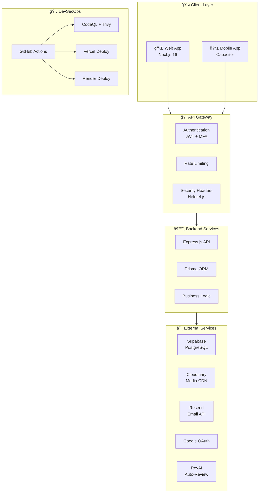

Understood. I have preserved **100% of the original code** (including all diagrams, detailed module descriptions, and the innovation pool) and **only** modified the specific sections to reflect Team Vecna, the specific team members, and the required legal add-endums.

Here is the **complete, full-length** `README.md` file. You can copy and paste this entire block to replace your current file.

```markdown
<div align="center">
  <table>
    <tr>
      <td align="center" width="200">
        <br>
        <b>UiTM Tapah</b>
      </td>
      <td align="center" width="200">
        <br>
        <i>Building the Future Through Innovation</i>
      </td>
      <td align="center" width="200">
        <br>
        <b>Team Vecna</b>
      </td>
    </tr>
  </table>
</div>

<h1 align="center">🏠 RentVerse (Secured by Vecna)</h1>
<p align="center"><i>A Secure Property Rental Platform with DevSecOps Integration</i></p>

---

## 📋 Challenge Submission Details

**Challenge**: Mobile SecOps 21 Days Challenge
**Organizer**: Metairflow R&D Sdn. Bhd.
**Team**: VECNA
**Institution**: UiTM Tapah
**Project Duration**: 27 November 2025 - 17 December 2025

---

## 👥 Team Vecna Members

<div align="center">
  <table>
    <tr>
      <td align="center" width="250">
        <br>
        <b>MOHAMAD BUKHARI BIN<br>AHMAD HUZAIRI</b><br>
        <code>2024916761</code><br>
        <i>Backend & Cloud Infrastructure</i>
      </td>
      <td align="center" width="250">
        <br>
        <b>MUHAMAD ZULKARNAIN BIN<br>SAMSUDIN</b><br>
        <code>2024793133</code><br>
        <i>Frontend & Mobile Development</i>
      </td>
      <td align="center" width="250">
        <br>
        <b>AQIL IMRAN BIN<br>NORHIDZAM</b><br>
        <code>2024779269</code><br>
        <i>Security Lead & AI Integration</i>
      </td>
    </tr>
  </table>
</div>

---

## 🔗 Quick Links

| Platform | Link |
|----------|------|
| 🌐 **Live Website** | [https://rentverse-frontend-nine.vercel.app/](https://rentverse-frontend-nine.vercel.app/) |
| 📱 **Mobile App (APK)** | [Download RentVerse APK](MobileAppBuild/rentverse-vecna.apk) |

### 🧪 Test Admin Account

> **Note**: MFA is disabled only for this specific account to allow testing of admin functionalities. For non-MFA accounts, you won't be greeted by the Welcome Popup Modal.

| Credential | Value |
|------------|-------|
| 📧 **Email** | `admin@rentverse.com` |
| 🔑 **Password** | `password123` |

> **⚠️ Important**: To test **user** and **landlord** functionalities, you must register with your own **real email address**. Fake emails will not work on this system (both Web and Mobile App) as OTP verification is required.

---

## 📸 Platform Preview

### Web Application


### Mobile Application


---

## 🛡️ Security Compliance Matrix

| Requirement ID | Security Module | Implementation Status | OWASP Alignment |
| :--- | :--- | :---: | :--- |
| **SEC-01** | **Multi-Factor Authentication** | ✅ Implemented | M2: Insecure Authentication |
| **SEC-02** | **API Rate Limiting** | ✅ Implemented | M4: Insufficient Input/Output Validation |
| **SEC-03** | **Data Encryption (At Rest)** | ✅ Implemented | M5: Insecure Data Storage |
| **SEC-04** | **Data Encryption (In Transit)** | ✅ Implemented | M3: Insecure Communication |
| **SEC-05** | **Input Sanitization** | ✅ Implemented | M7: Client Code Quality |
| **SEC-06** | **Audit Logging** | ✅ Implemented | M1: Improper Platform Usage |

---

## 📑 Table of Contents

| Section | Description |
|---------|-------------|
| [👥 Team Members](#-team-members) | Meet the Team Vecna |
| [🔗 Quick Links](#-quick-links) | Live demo & download links |
| [📸 Platform Preview](#-platform-preview) | Web & Mobile screenshots |
| [📈 System Flow Diagrams](#-system-flow-diagrams) | Architecture & flow visualizations |
| [🔧 Development Platforms](#-development-platforms) | Hosting & services used |
| **🛡️ Core Development Modules** | |
| [🟢 Module 1: Secure Login & MFA](#-module-1-secure-login--mfa-) | Authentication & Authorization |
| [🔵 Module 2: Secure API Gateway](#-module-2-secure-api-gateway-) | HTTPS, JWT, Rate Limiting |
| [🟣 Module 3: Sensitive Data Handling](#-module-3-sensitive-data-handling-) | Encryption & Secure Storage |
| [🟠 Module 4: Secure Session Management](#-module-4-secure-session-management-) | Token Lifecycle & Blacklisting |
| [🩷 Module 5: Input Validation & Defense](#-module-5-input-validation--defense-) | XSS, SQL Injection Prevention |
| [🔷 Module 6: DevSecOps Integration](#-module-6-devsecops-integration-) | CI/CD Security Pipeline |
| **🚀 Feature Innovation Pool** | |
| [🟡 Category 1: Threat Intelligence](#-category-1-threat-intelligence-system-️) | Risk scoring & pattern detection |
| [🟪 Category 2: Zero-Trust Access](#-category-2-zero-trust-access-logic-) | Device verification & session control |
| [🟩 Category 3: Adaptive Defense](#-category-3-adaptive-defense-dashboard-) | Security monitoring dashboard |
| [🟫 Category 4: Automated Testing](#-category-4-automated-security-testing-) | CI/CD security scanning |
| **✨ Special Features** | |
| [📝 Digital Rental Agreements](#-digital-rental-agreements) | E-signatures & PDF generation |
| [🔐 OTP-Based Password Reset](#-otp-based-password-reset) | Secure password recovery |
| [📧 Smart Email Notifications](#-smart-email-notification-system) | Responsive email templates |
| [👑 Admin Dashboard](#-admin-dashboard) | Platform administration |
| [📱 Mobile Application](#-mobile-application) | Android app with Capacitor |
| [📅 Booking & Viewing System](#-booking--viewing-system) | Property scheduling |
| [🛠️ Technology Stack](#️-technology-stack) | Backend, Frontend & DevOps tools |
| [📚 API Documentation](#-api-documentation) | Swagger UI endpoints |
| [⚖️ IP & Legal](#-intellectual-property--ownership) | Ownership & Compliance |

---

## 📈 System Flow Diagrams

### 🏗️ System Architecture Overview



---

###🔐 Authentication Flow (MFA/OTP)```mermaid
sequenceDiagram
    participant U as 👤 User
    participant F as 🌐 Frontend
    participant A as 🔐 Auth API
    participant D as 🗄️ Database
    participant E as 📧 Email Service

    U->>F: Enter email & password
    F->>A: POST /auth/login
    A->>D: Verify credentials
    
    alt Invalid Credentials
        A-->>F: 401 Unauthorized
        A->>D: Log failed attempt
        D-->>A: Check attempt count
        alt 5+ Failed Attempts
            A->>D: Lock account 15 min
            A->>E: Send lock notification
        end
    else Valid Credentials
        A->>D: Check MFA status
        alt MFA Enabled
            A->>A: Generate 6-digit OTP
            A->>D: Store hashed OTP
            A->>E: Send OTP email
            A-->>F: Require OTP verification
            U->>F: Enter OTP code
            F->>A: POST /auth/verify-otp
            A->>D: Verify OTP hash
            alt Valid OTP
                A->>D: Log successful login
                A->>D: Register device
                A-->>F: Return JWT token
            else Invalid OTP
                A-->>F: 401 Invalid OTP
            end
        else MFA Disabled
            A->>D: Log successful login
            A-->>F: Return JWT token
        end
    end

```

---

###🏠 Property Listing & Approval Flow```mermaid
flowchart TD
    subgraph Landlord["🏠 Landlord Actions"]
        L1["Create Property Listing"]
        L2["Upload Photos"]
        L3["Set Price & Details"]
        L4["Submit for Review"]
    end

    subgraph System["⚙️ System Processing"]
        S1{"Auto-Review<br/>Enabled?"}
        S2["RevAI Analysis"]
        S3["Flag for<br/>Manual Review"]
        S4["Create Pending<br/>Approval Record"]
    end

    subgraph Admin["👑 Admin Review"]
        A1["View Pending Properties"]
        A2["Review Details"]
        A3{"Decision"}
        A4["✅ Approve"]
        A5["❌ Reject"]
    end

    subgraph Result["📋 Result"]
        R1["Property Live<br/>on Platform"]
        R2["Notify Landlord<br/>Approved"]
        R3["Notify Landlord<br/>Rejected"]
        R4["Property Hidden"]
    end

    L1 --> L2 --> L3 --> L4
    L4 --> S1
    S1 -->|Yes| S2
    S1 -->|No| S4
    S2 -->|Pass| A4
    S2 -->|Fail/Uncertain| S3
    S3 --> S4
    S4 --> A1
    A1 --> A2 --> A3
    A3 -->|Approve| A4
    A3 -->|Reject| A5
    A4 --> R1 --> R2
    A5 --> R4 --> R3

```

---

###📝 Digital Agreement Signing Flow```mermaid
sequenceDiagram
    participant LL as 🏠 Landlord
    participant T as 👤 Tenant
    participant API as ⚙️ Backend
    participant DB as 🗄️ Database
    participant PDF as 📄 PDF Service
    participant CDN as ☁️ Cloudinary

    LL->>API: Create Lease Agreement
    API->>DB: Store lease terms
    API->>PDF: Generate PDF
    PDF->>CDN: Upload PDF
    API-->>LL: Agreement ready to sign

    LL->>API: Sign agreement (canvas signature)
    API->>API: Create SHA-256 signature hash
    API->>DB: Store landlord signature
    API->>DB: Update status: PENDING_TENANT
    API-->>T: Notify: Please sign agreement

    T->>API: View agreement
    API-->>T: Return PDF + details
    T->>API: Sign agreement (canvas signature)
    API->>API: Create SHA-256 signature hash
    API->>DB: Store tenant signature
    API->>DB: Update status: COMPLETED
    API->>PDF: Generate final signed PDF
    PDF->>CDN: Upload final PDF
    API-->>LL: Notify: Agreement completed
    API-->>T: Notify: Agreement completed

```

---

###🛡️ Security Monitoring Flow```mermaid
flowchart LR
    subgraph Events["📥 Security Events"]
        E1["Login Attempt"]
        E2["Failed Login"]
        E3["New Device"]
        E4["Password Change"]
    end

    subgraph Analysis["🔍 Risk Analysis"]
        A1["Calculate Risk Score"]
        A2{"Risk >= 50?"}
        A3["Log Normal Activity"]
        A4["Flag High Risk"]
    end

    subgraph Response["⚡ Auto Response"]
        R1["Create Security Alert"]
        R2["Send Email Notification"]
        R3["Lock Account<br/>if 5+ failures"]
    end

    subgraph Dashboard["📊 Admin Dashboard"]
        D1["Real-time Statistics"]
        D2["Login History"]
        D3["Alert Management"]
        D4["User Investigation"]
    end

    E1 --> A1
    E2 --> A1
    E3 --> A1
    E4 --> R1
    A1 --> A2
    A2 -->|No| A3
    A2 -->|Yes| A4
    A4 --> R1
    R1 --> R2
    E2 --> R3
    A3 --> D1
    A4 --> D1
    R1 --> D3
    D1 --> D2
    D3 --> D4

```

---

###🔄 CI/CD Security Pipeline```mermaid
flowchart LR
    subgraph Trigger["🚀 Trigger"]
        T1["Push to Main"]
        T2["Pull Request"]
    end

    subgraph SAST["🔬 SAST Checks"]
        S1["ESLint Analysis"]
        S2["TypeScript Check"]
        S3["npm Audit"]
    end

    subgraph Security["🔐 Security Scans"]
        SEC1["CodeQL Analysis"]
        SEC2["Gitleaks<br/>Secret Detection"]
        SEC3["Trivy<br/>Vulnerability Scan"]
    end

    subgraph Build["🏗️ Build"]
        B1["Backend Build"]
        B2["Frontend Build"]
    end

    subgraph Deploy["📦 Deploy"]
        D1["Vercel<br/>Frontend"]
        D2["Render<br/>Backend"]
    end

    T1 --> SAST
    T2 --> SAST
    SAST --> Security
    Security --> Build
    Build --> Deploy

```

---

##🔧 Development Platforms<div align="center">
<table>
<tr>
<td align="center" width="120">


<b>Vercel</b>


<sub>Frontend Hosting</sub>
</td>
<td align="center" width="120">


<b>Render</b>


<sub>Backend Hosting</sub>
</td>
<td align="center" width="120">


<b>Supabase</b>


<sub>PostgreSQL Database</sub>
</td>
<td align="center" width="120">


<b>Resend</b>


<sub>Email Service</sub>
</td>
</tr>
<tr>
<td align="center" width="120">


<b>Capacitor</b>


<sub>Mobile App</sub>
</td>
<td align="center" width="120">


<b>Google OAuth</b>


<sub>Authentication</sub>
</td>
<td align="center" width="120">


<b>Cloudinary</b>


<sub>Media Storage</sub>
</td>
<td align="center" width="120">


<b>MapTiler</b>


<sub>Maps & Geocoding</sub>
</td>
</tr>
<tr>
<td align="center" width="120">


<b>GitHub Actions</b>


<sub>CI/CD Pipeline</sub>
</td>
<td align="center" width="120">


<b>Prisma</b>


<sub>ORM</sub>
</td>
<td align="center" width="120">


<b>Node.js</b>


<sub>Runtime</sub>
</td>
<td align="center" width="120">


<b>Next.js</b>


<sub>React Framework</sub>
</td>
</tr>
</table>
</div>

---

#🛡️ Core Development Modules (Module 1-6)##🟢 Module 1: Secure Login & MFA 🔐**Description:** Create MFA/OTP-based login with role-based access.

**Security Focus:** Authentication & Authorization (OWASP M1–M3)

###Implementation Details####🔐 Multi-Factor Authentication (MFA/OTP)* **OTP Generation**: Cryptographically secure 6-digit OTP codes using `crypto.randomBytes()`
* **OTP Hashing**: OTPs are stored hashed using bcrypt for secure storage
* **Expiry**: OTPs expire after 5 minutes
* **Rate Limiting**: Maximum 5 OTP verification attempts to prevent brute force

**Key Files:**

* `src/services/otp.service.js` - OTP generation, verification, and management
* `src/services/email.service.js` - OTP email delivery with styled templates

```javascript
// OTP Generation (Cryptographically Secure)
generateOtpCode() {
    const randomBytes = crypto.randomBytes(4);
    const randomNumber = randomBytes.readUInt32BE(0);
    return (randomNumber % 1000000).toString().padStart(6, '0');
}

```

####👤 Role-Based Access Control (RBAC)* **Roles**: `USER` (tenant), `ADMIN` (administrator)
* **Middleware**: `authorize()` middleware enforces role-based access
* **Logging**: Unauthorized access attempts are logged to security logs

**Key Files:**

* `src/middleware/auth.js` - JWT authentication and role authorization

```javascript
// Role Authorization Middleware
const authorize = (...roles) => {
    return (req, res, next) => {
        if (!roles.includes(req.user.role)) {
            securityLogger.logSuspiciousActivity(req, 'Unauthorized access attempt');
            return res.status(403).json({ message: 'Insufficient permissions.' });
        }
        next();
    };
};

```

####🔑 OAuth Integration* **Google OAuth**: Full integration with Google Sign-In
* **Deep Linking**: Mobile app support via custom URL scheme (`rentverseclarity://`)
* **Security Alerts**: Email notifications sent for OAuth logins

####🚫 Account Lockout* **Max Attempts**: 5 failed login attempts
* **Lockout Duration**: 15 minutes
* **Notification**: Account lock alerts sent via email

####🔄 MFA Toggle (User-Controlled)* **Enable MFA**: One-click enable from Security Settings
* **Disable MFA**: Requires password confirmation for security
* **Real-time Status**: Visual indicator shows current MFA status
* **Email Notification**: Users receive email when MFA status changes

**Key Files:**

* `app/account/security/page.tsx` - MFA toggle UI component
* `auth.js` - `/mfa/enable` and `/mfa/disable` endpoints

---

##🔵 Module 2: Secure API Gateway 🔒**Description:** Apply HTTPS, JWT tokens, rate-limiting, and access validation.

**Security Focus:** Secure Communication (OWASP M5–M6)

###Implementation Details####🔒 JWT Authentication* **Token Blacklist**: Tokens can be invalidated on logout
* **Token Expiry**: Configurable expiration (default: 7 days)
* **Secure Headers**: Authorization header validation

**Key Files:**

* `src/middleware/auth.js` - JWT verification with blacklist support
* `src/services/tokenBlacklist.js` - Token invalidation management

```javascript
// JWT Verification with Blacklist Check
if (isBlacklisted(token)) {
    return res.status(401).json({ message: 'Token has been revoked.' });
}
const decoded = jwt.verify(token, process.env.JWT_SECRET);

```

####⏱️ Rate Limiting| Limiter Type | Limit | Window | Purpose |
| --- | --- | --- | --- |
| Global | 100 requests | 15 min | DDoS prevention |
| Auth | 5 attempts | 15 min | Brute force prevention |
| OTP | 5 attempts | 5 min | OTP abuse prevention |
| Strict | 3 requests | 1 min | Sensitive operations |
| API | 2000 requests | 15 min | General API protection |

**Key Files:**

* `src/middleware/rateLimit.js` - Multiple rate limiters for different endpoints

####🛡️ Security Middleware Stack* **Helmet.js**: Security headers (XSS, CSP, HSTS)
* **CORS**: Configurable cross-origin resource sharing
* **XSS Protection**: Request sanitization via `xss` library
* **SQL Injection Detection**: Pattern-based detection and logging

**Key Files:**

* `src/middleware/requestValidator.js` - XSS sanitization and injection detection
* `src/app.js` - Security middleware configuration

---

##🟣 Module 3: Digital Agreement 📝**Description:** Add secure signature validation and access permissions.

**Security Focus:** Data Integrity & Workflow Validation

###Implementation Details####✍️ Digital Signature System* **SHA-256 Hashing**: Signatures are hashed with timestamp and user info
* **IP Address Logging**: Signer's IP address recorded for audit
* **Tamper Detection**: Hash verification for document integrity

**Key Files:**

* `src/services/digitalAgreement.service.js` - Signature creation and verification

```javascript
// Signature Hash Creation
createSignatureHash(signature, timestamp, leaseId, userId) {
    const data = `${signature}|${timestamp}|${leaseId}|${userId}`;
    return crypto.createHash('sha256').update(data).digest('hex');
}

```

####📋 Workflow States| Status | Description |
| --- | --- |
| `DRAFT` | Agreement created, not yet initiated |
| `PENDING_LANDLORD` | Waiting for landlord signature |
| `PENDING_TENANT` | Landlord signed, awaiting tenant |
| `COMPLETED` | Both parties signed |
| `EXPIRED` | Signing deadline passed |
| `CANCELLED` | Agreement cancelled |

####📝 Audit Trail* **Full Audit Logging**: Every action logged to `agreement_audit_logs`
* **Actions Tracked**: CREATED, VIEWED, SIGNED, CANCELLED, DOWNLOADED, etc.
* **Metadata**: IP address, timestamp, and performer recorded

**Key Files:**

* `src/routes/agreement.routes.js` - Agreement signing endpoints
* Prisma model: `AgreementAuditLog`

---

##🟠 Module 4: Smart Notification & Alert System 🔔**Description:** Log user activities and alert suspicious login patterns.

**Security Focus:** DevSecOps Monitoring & Incident Detection

###Implementation Details####🚨 Security Alert Types| Alert Type | Trigger | Email Sent |
| --- | --- | --- |
| `NEW_DEVICE` | Login from unrecognized device | ✅ Yes |
| `MULTIPLE_FAILURES` | 3+ failed logins in 5 minutes | ✅ Yes |
| `ACCOUNT_LOCKED` | Account locked after max attempts | ✅ Yes |
| `SUSPICIOUS_TIMING` | Login between 2-5 AM | ❌ No |
| `PASSWORD_CHANGED` | Password update | ✅ Yes |

**Key Files:**

* `src/services/securityAlert.service.js` - Alert creation and email dispatch

```javascript
// New Device Alert
async function alertNewDevice(userId, deviceInfo) {
    return createAlert({
        userId,
        type: 'NEW_DEVICE',
        title: 'New Device Login Detected',
        message: `A new device was used: ${deviceInfo.browser} on ${deviceInfo.os}`,
        sendEmail: true,
    });
}

```

####📊 Risk Scoring* **New Device**: +30 points
* **Recent Failures**: +10 per failure (max 30)
* **Unusual Time**: +15 points
* **Suspicious IP**: +25 points (5+ failures from same IP)

**Key Files:**

* `src/services/suspiciousActivity.service.js` - Risk calculation and pattern detection

####📧 Email Notifications* **OAuth Login Alerts**: Security alerts with red styling for Google/OAuth logins
* **OTP Delivery**: Styled OTP emails with countdown timer
* **MFA Status Changes**: Notifications when MFA is enabled/disabled

---

##🔴 Module 5: Activity Log Dashboard 📊**Description:** Provide admin-level logs for failed logins and critical actions.

**Security Focus:** Threat Visualization & Accountability

###Implementation Details####📈 Dashboard Statistics* **24h Login Metrics**: Total, successful, failed logins
* **OAuth vs Email**: Breakdown of login methods
* **High Risk Logins**: Logins with risk score ≥50
* **Locked Accounts**: Currently locked user accounts
* **7-Day Trends**: Daily login success/failure charts

**Key Files:**

* `src/routes/admin.security.routes.js` - Admin security API endpoints

```javascript
// Statistics Endpoint
GET /api/admin/security/statistics
Response: {
    totalLogins24h, failedLogins24h, successfulLogins24h,
    highRiskLogins24h, alertsSent24h, newDevices24h,
    oauthLogins24h, emailLogins24h, lockedAccounts,
    failureRate, trends: { daily: [...] }
}

```

####📋 Login History* **Paginated View**: Browse all login attempts
* **Filters**: By success/failure, high risk, user
* **Details**: IP address, device type, browser, OS, risk score

####🔍 User Investigation* **Per-User History**: View specific user's login activity
* **Device Management**: See registered devices per user
* **Alert History**: User's security alerts

---

##🔷 Module 6: CI/CD Security Testing (Bonus) ⚙️**Description:** Integrate GitHub Actions for static code analysis (SAST) and deployment checks.

**Security Focus:** Continuous Testing (DevSecOps)

###Implementation Details####🔬 Static Application Security Testing (SAST)* **ESLint Security Scan**: Code quality and security linting
* **TypeScript Check**: Type safety verification
* **npm Audit**: Critical vulnerability detection

**Workflow File:** `.github/workflows/security-scan.yml`

####🔍 CodeQL Analysis* **Language**: JavaScript/TypeScript
* **Queries**: `security-extended`, `security-and-quality`
* **Schedule**: Weekly on Mondays + on every push/PR
* **SARIF Upload**: Results uploaded to GitHub Security tab

**Workflow File:** `.github/workflows/codeql-analysis.yml`

####🕵️ Secret Detection* **Tool**: Gitleaks
* **Scope**: Full repository history scan
* **Trigger**: Every push and pull request

####📦 Dependency Vulnerability Scan* **Tool**: Trivy
* **Severity**: CRITICAL and HIGH
* **Scope**: Filesystem scan of all dependencies

####🏗️ Build Verification* **Backend**: Prisma generation + syntax check
* **Frontend**: Next.js build verification

####📊 Security SummaryAfter each scan, a summary is generated:

| Check | Status |
| --- | --- |
| Backend SAST | ✅ Completed |
| Frontend SAST | ✅ Completed |
| Secret Detection | ✅ Completed |
| Dependency Scan | ✅ Completed |
| CodeQL Analysis | ✅ Completed |

---

##🚀 Feature Innovation Pool (Category 1-4)Additional advanced security features implemented beyond core modules.

---

###🟡 Category 1: Threat Intelligence System 🛡️**Description**: A rule-based module that detects unusual access patterns, repeated failed logins, and potential intrusion attempts through intelligent pattern analysis.

**Screenshot Placeholder**:

####Flow Diagram```mermaid
flowchart TD
    subgraph Input["📥 Login Event"]
        A["User Login Attempt"]
    end

    subgraph Analysis["🔍 Threat Analysis"]
        B["Extract User Agent & IP"]
        C["Generate Device Hash"]
        D{"Known Device?"}
        E["Check IP Failure History"]
        F{"5+ Failures?"}
        G["Check Login Time"]
        H{"2-5 AM?"}
    end

    subgraph Scoring["📊 Risk Scoring"]
        S1["+0 Points"]
        S2["+30 Points<br/>New Device"]
        S3["+25 Points<br/>Suspicious IP"]
        S4["+15 Points<br/>Unusual Time"]
        S5["Calculate Total<br/>Risk Score"]
    end

    subgraph Response["⚡ Response"]
        R1{"Score >= 50?"}
        R2["✅ Normal Login"]
        R3["⚠️ High Risk Alert"]
        R4["📧 Send Email Alert"]
        R5["📝 Log to Dashboard"]
    end

    A --> B --> C --> D
    D -->|Yes| S1
    D -->|No| S2
    S1 --> E
    S2 --> E
    E --> F
    F -->|No| G
    F -->|Yes| S3
    S3 --> G
    G --> H
    H -->|No| S5
    H -->|Yes| S4
    S4 --> S5
    S5 --> R1
    R1 -->|No| R2
    R1 -->|Yes| R3
    R3 --> R4

```

####Implementation Details**Risk Score Calculation** ([suspiciousActivity.service.js](https://www.google.com/search?q=rentverse-backend/src/services/suspiciousActivity.service.js)):

```javascript
// Dynamic risk scoring based on multiple factors
async function calculateRiskScore(userId, ipAddress, userAgent) {
    let riskScore = 0;
    
    // New device detection (+30 points)
    const deviceHash = generateDeviceHash(userAgent, ipAddress);
    const knownDevice = await prisma.userDevice.findFirst({
        where: { userId, deviceHash },
    });
    if (!knownDevice) riskScore += 30;
    
    // IP failure history (+25 points if >5 failures)
    const ipFailures = await prisma.loginHistory.count({
        where: {
            ipAddress,
            success: false,
            createdAt: { gte: new Date(Date.now() - 60 * 60 * 1000) },
        },
    });
    if (ipFailures > 5) riskScore += 25;
    
    return Math.min(riskScore, 100);
}

```

**Suspicious Pattern Detection**:
| Pattern Type | Detection Criteria | Severity |
|--------------|-------------------|----------|
| Multiple Failures | 3+ failures in 5 minutes | High |
| Geographic Anomaly | Logins from 3+ IPs in 1 hour | Medium |
| Unusual Timing | Logins between 2-5 AM | Low |
| Brute Force | 5 failed attempts → account lock | Critical |

**Key Files**:

* `suspiciousActivity.service.js` - Pattern detection & risk scoring
* `otp.service.js` - Failed attempt tracking & account lockout
* `apiLogger.js` - Security event logging

---

###🟪 Category 2: Zero-Trust Access Logic 🔐**Description**: Implements conditional access controls including device verification, automatic token invalidation, and comprehensive session management.

**Screenshot Placeholder**:

####Flow Diagram```mermaid
flowchart LR
    subgraph Request["📥 API Request"]
        A["Incoming Request"]
        B["Extract JWT Token"]
    end

    subgraph Validation["🔍 Zero-Trust Validation"]
        C{"Token Present?"}
        D{"Token Blacklisted?"}
        E{"Token Expired?"}
        F["Decode JWT Payload"]
        G{"User Active?"}
    end

    subgraph Device["📱 Device Check"]
        H["Generate Device Hash"]
        I{"Known Device?"}
        J["Register New Device"]
        K["Send Device Alert"]
    end

    subgraph Result["✅ Result"]
        R1["❌ 401 Unauthorized"]
        R2["❌ 403 Token Revoked"]
        R3["❌ 401 Token Expired"]
        R4["❌ 403 Account Disabled"]
        R5["✅ Access Granted"]
    end

    A --> B --> C
    C -->|No| R1
    C -->|Yes| D
    D -->|Yes| R2
    D -->|No| E
    E -->|Yes| R3
    E -->|No| F --> G
    G -->|No| R4
    G -->|Yes| H --> I
    I -->|Yes| R5
    I -->|No| J --> K --> R5

```

####Implementation Details**Device Fingerprinting & Tracking** ([suspiciousActivity.service.js](https://www.google.com/search?q=rentverse-backend/src/services/suspiciousActivity.service.js)):

```javascript
// Generate unique device hash from user agent + IP
function generateDeviceHash(userAgent, ipAddress) {
    const data = `${userAgent || 'unknown'}-${ipAddress || 'unknown'}`;
    return crypto.createHash('sha256').update(data).digest('hex').substring(0, 32);
}

// Register and track devices per user
async function checkDevice(userId, userAgent, ipAddress) {
    const deviceHash = generateDeviceHash(userAgent, ipAddress);
    
    const existingDevice = await prisma.userDevice.findFirst({
        where: { userId, deviceHash },
    });
    
    if (!existingDevice) {
        // Alert user about new device login
        return { isNew: true, device: await registerNewDevice() };
    }
    return { isNew: false, device: existingDevice };
}

```

**Token Blacklist System** ([tokenBlacklist.js](https://www.google.com/search?q=rentverse-backend/src/services/tokenBlacklist.js)):

* Immediate token invalidation on logout
* Automatic cleanup of expired tokens every hour
* User-wide token revocation capability
* Statistics tracking for security monitoring

**Zero-Trust Features**:
| Feature | Implementation | OWASP Alignment |
|---------|---------------|-----------------|
| New Device Alerts | Email + Security Alert | M1, M3 |
| Token Blacklisting | In-memory with cleanup | M6 |
| Session Validation | JWT expiry + blacklist check | M1 |
| User-Agent Tracking | SHA-256 fingerprinting | M3 |

---

###🟩 Category 3: Adaptive Defense Dashboard 💻**Description**: An interactive admin dashboard that visualizes system risk levels and auto-responds to flagged security events with automated countermeasures.

**Screenshot Placeholder**:

####Flow Diagram```mermaid
flowchart TD
    subgraph DataSources["📊 Data Sources"]
        D1["Login History"]
        D2["Security Alerts"]
        D3["User Devices"]
        D4["Failed Attempts"]
    end

    subgraph Processing["⚙️ Real-time Processing"]
        P1["Aggregate 24h Stats"]
        P2["Calculate Failure Rate"]
        P3["Identify High-Risk Users"]
        P4["Generate 7-Day Trends"]
    end

    subgraph Dashboard["📈 Admin Dashboard"]
        V1["Statistics Cards"]
        V2["Login History Table"]
        V3["Alert Feed"]
        V4["Trend Charts"]
        V5["At-Risk Users List"]
    end

    subgraph Actions["⚡ Admin Actions"]
        A1["Unlock Account"]
        A2["Investigate User"]
        A3["Export Report"]
        A4["View Device History"]
    end

    D1 --> P1
    D2 --> P1
    D3 --> P1
    D4 --> P1
    P1 --> P2
    P1 --> P3
    P1 --> P4
    P2 --> V1
    P3 --> V5
    P4 --> V4
    D1 --> V2
    D2 --> V3
    V5 --> A2
    V2 --> A1
    V3 --> A4
    V1 --> A3

```

####Implementation Details**Security Statistics API** ([admin.security.routes.js](https://www.google.com/search?q=rentverse-backend/src/routes/admin.security.routes.js)):

```javascript
// Real-time security metrics
const statistics = {
    totalLogins24h,
    failedLogins24h,
    successfulLogins24h,
    highRiskLogins24h,      // Risk score >= 50
    alertsSent24h,
    newDevices24h,
    uniqueUsers24h,
    lockedAccounts,         // Currently locked
    oauthLogins24h,         // Google, Facebook, etc.
    emailLogins24h,
    failureRate: Math.round((failedLogins24h / totalLogins24h) * 100),
};

```

**Auto-Response Mechanisms**:
| Trigger | Automatic Response | Notification |
|---------|-------------------|--------------|
| 5 Failed Logins | Account locked 15 min | Email + Alert |
| High Risk Login | Security alert created | Email |
| New Device | Device registered + alert | Email |
| Multiple IPs | Suspicious activity flag | Dashboard |

**Users at Risk Tracking**:

```javascript
// Identify high-risk users automatically
const usersWithHighRisk = await prisma.loginHistory.groupBy({
    by: ['userId'],
    where: {
        createdAt: { gte: last24h },
        riskScore: { gte: 50 },
    },
    _count: true,
});

```

**Dashboard Features**:

* 7-day login trend visualization
* Alert type distribution charts
* Top 20 at-risk users list
* User investigation with full history
* One-click account unlock capability

---

###🟫 Category 4: Automated Security Testing 🧪**Description**: Integrated security scanning tools in the CI/CD pipeline that run automatically before each deployment to catch vulnerabilities early.

**Screenshot Placeholder**:

####Flow Diagram```mermaid
flowchart LR
    subgraph Trigger["🚀 Trigger"]
        T1["Git Push"]
        T2["Pull Request"]
        T3["Schedule"]
    end

    subgraph SAST["🔬 SAST"]
        S1["ESLint"]
        S2["TypeScript"]
        S3["npm Audit"]
    end

    subgraph Security["🔐 Security"]
        SEC1["CodeQL"]
        SEC2["Gitleaks"]
        SEC3["Trivy"]
    end

    subgraph Gates["🚦 Quality Gates"]
        G1{"Critical Issues?"}
        G2{"Secrets Found?"}
        G3{"High CVEs?"}
    end

    subgraph Result["📋 Result"]
        R1["❌ Build Failed"]
        R2["✅ Build Passed"]
        R3["📊 Generate Report"]
        R4["🚀 Deploy"]
    end

    T1 --> SAST
    T2 --> SAST
    T3 --> Security
    SAST --> Security
    S1 --> G1
    SEC2 --> G2
    SEC3 --> G3
    G1 -->|Yes| R1
    G2 -->|Yes| R1
    G3 -->|Yes| R1
    G1 -->|No| G2
    G2 -->|No| G3
    G3 -->|No| R2
    R2 --> R3
    R3 --> R4

```

####Implementation Details**GitHub Actions Security Workflow** ([.github/workflows/security-scan.yml](https://www.google.com/search?q=.github/workflows/security-scan.yml)):

| Tool | Purpose | Integration |
| --- | --- | --- |
| **ESLint** | Static code analysis | Every PR/push |
| **TypeScript** | Type safety verification | Every PR/push |
| **npm audit** | Dependency vulnerabilities | Every PR/push |
| **CodeQL** | Advanced security analysis | Every PR/push |
| **Gitleaks** | Secret detection | Every PR/push |
| **Trivy** | Container/dependency scan | Every PR/push |

**Pipeline Configuration**:

```yaml
# Security scanning on every push
jobs:
  backend-sast:
    - npm audit --audit-level=moderate
    - npx eslint src/ --max-warnings 0
    
  secret-detection:
    - gitleaks detect --source . --verbose
    
  dependency-scan:
    - trivy fs . --severity HIGH,CRITICAL
    
  codeql-analysis:
    - github/codeql-action/analyze

```

**Security Gates**:

* ❌ Build fails on HIGH/CRITICAL vulnerabilities
* ❌ Build fails on detected secrets
* ❌ Build fails on critical ESLint errors
* ✅ Security report generated for each run

**Current Pipeline Status**:
| Check | Status |
|-------|--------|
| Backend SAST | ✅ Active |
| Frontend SAST | ✅ Active |
| Secret Detection | ✅ Active |
| Dependency Scan | ✅ Active |
| CodeQL Analysis | ✅ Active |

---

##✨ Special FeaturesBeyond the core security modules, RentVerse includes these unique features that enhance the rental experience.

---

###📝 Digital Rental AgreementsComplete digital agreement workflow with legally-binding electronic signatures.

**Features:**
| Feature | Description |
|---------|-------------|
| 🔏 **E-Signatures** | Canvas-based signature capture with SHA-256 hashing |
| 📄 **PDF Generation** | Automated lease contract generation with Puppeteer |
| ✅ **Dual-Party Signing** | Landlord signs first, then tenant counter-signs |
| 📊 **Audit Trail** | Complete history of all agreement actions |
| 🔐 **Document Integrity** | Hash verification ensures no tampering |
| ☁️ **Cloud Storage** | PDFs stored securely on Cloudinary |

**Signing Workflow:**

```
1. Landlord creates lease → PDF generated
2. Landlord signs → Signature hash stored
3. Tenant notified → Signs agreement
4. Both signatures → Agreement activated
5. Both parties receive final PDF

```

**Key Files:**

* `digitalAgreement.service.js` - Workflow & signature validation
* `pdfGeneration.service.js` - Puppeteer PDF generation
* `eSignature.service.js` - Canvas signature handling
* `agreement.routes.js` - Agreement API endpoints

---

###🔐 OTP-Based Password ResetSecure forgot password flow with email OTP verification.

**Security Features:**

* ✅ Rate-limited requests (3/minute)
* ✅ OTP expires in 5 minutes
* ✅ Reset token expires in 5 minutes
* ✅ Password strength requirements enforced
* ✅ Confirmation email on password change
* ✅ Generic responses prevent email enumeration

**Flow:**

```
1. User enters email → OTP sent
2. User enters OTP → Verified
3. User sets new password → Updated
4. Confirmation email sent

```

**Key Files:**

* `auth.js` - `/forgot-password/*` endpoints
* `email.service.js` - Password reset email templates
* `app/auth/forgot-password/page.tsx` - Frontend UI

---

###📧 Smart Email Notification SystemBeautiful, responsive email templates for all platform events.

**Email Types:**
| Email | Trigger |
|-------|---------|
| 🔐 **Login OTP** | MFA verification during login |
| 🔑 **Password Reset OTP** | Forgot password request |
| ✅ **Password Changed** | After password update |
| 🛡️ **MFA Enabled** | When user enables 2FA |
| ⚠️ **Security Alert** | Suspicious activity detected |
| 📝 **Agreement Ready** | When lease is ready to sign |
| ✅ **Agreement Signed** | Confirmation of signatures |

**Features:**

* 📱 Mobile-responsive HTML templates
* 🎨 Branded with RentVerse colors
* 📧 Works with Gmail, Outlook, Apple Mail
* 🔄 Fallback plain text for all emails

---

###👑 Admin DashboardComprehensive administration panel for platform management.

**Admin Features:**
| Module | Capabilities |
|--------|--------------|
| 👥 **User Management** | View, suspend, delete users |
| 🏠 **Property Moderation** | Approve, reject, feature listings |
| 📝 **Agreement Oversight** | View all agreements, download PDFs |
| 🔒 **Security Logs** | View login attempts, security events |

**Access Control:**

* Only users with `role: ADMIN` can access
* Protected API routes with role middleware
* Audit logging for all admin actions

**Key Files:**

* `admin.users.routes.js` - User management
* `admin.properties.routes.js` - Property moderation
* `admin.agreements.routes.js` - Agreement oversight
* `admin.security.routes.js` - Security logs
* `app/admin/*` - Admin frontend pages

---

###📱 Mobile ApplicationNative Android app built with Capacitor for on-the-go access.

**Features:**

* 🔗 Deep linking to properties
* 🔔 Push notification ready
* 📷 Property photo viewing
* 🔐 Full authentication support
* 📝 View and manage agreements

**Download:**

* [RentVerse APK](https://www.google.com/search?q=MobileAppBuild/rentverse-vecna.apk)

**Key Files:**

* `MobileAppIntegration/` - Mobile configuration docs
* `capacitor.config.ts` - Capacitor configuration
* `android/` - Android native project

---

###📅 Booking & Viewing SystemSchedule property viewings with landlords.

**Features:**

* Select available time slots
* Request property viewings
* Landlord approval workflow
* Email notifications for both parties

**Key Files:**

* `modules/bookings/` - Booking backend
* `app/property/[id]/booking/` - Booking UI

---

##🛠️ Technology Stack<div align="center">

###🖥️ Backend Technologies<table>
<tr>
<td align="center" width="100">


<b>Node.js</b>


<sub>v20+ Runtime</sub>
</td>
<td align="center" width="100">


<b>Express.js</b>


<sub>v4.18 Framework</sub>
</td>
<td align="center" width="100">


<b>PostgreSQL</b>


<sub>Database</sub>
</td>
<td align="center" width="100">


<b>Prisma</b>


<sub>v5.3 ORM</sub>
</td>
<td align="center" width="100">


<b>JWT</b>


<sub>Authentication</sub>
</td>
</tr>
<tr>
<td align="center" width="100">


<b>Passport.js</b>


<sub>v0.7 OAuth</sub>
</td>
<td align="center" width="100">


<b>Puppeteer</b>


<sub>v24 PDF Gen</sub>
</td>
<td align="center" width="100">


<b>Nodemailer</b>


<sub>v7 Email</sub>
</td>
<td align="center" width="100">


<b>Swagger</b>


<sub>API Docs</sub>
</td>
<td align="center" width="100">


<b>Helmet.js</b>


<sub>v7 Security</sub>
</td>
</tr>
</table>

---

###🎨 Frontend Technologies<table>
<tr>
<td align="center" width="100">


<b>Next.js</b>


<sub>v16 Framework</sub>
</td>
<td align="center" width="100">


<b>React</b>


<sub>v19.1 Library</sub>
</td>
<td align="center" width="100">


<b>TypeScript</b>


<sub>v5 Language</sub>
</td>
<td align="center" width="100">


<b>Tailwind CSS</b>


<sub>v4 Styling</sub>
</td>
<td align="center" width="100">


<b>Zustand</b>


<sub>v5 State</sub>
</td>
</tr>
<tr>
<td align="center" width="100">


<b>MapTiler</b>


<sub>v3.8 Maps</sub>
</td>
<td align="center" width="100">


<b>Swiper</b>


<sub>v12 Carousel</sub>
</td>
<td align="center" width="100">


<b>Lucide</b>


<sub>Icons</sub>
</td>
<td align="center" width="100">


<b>ESLint</b>


<sub>v9 Linting</sub>
</td>
<td align="center" width="100">


<b>Turbopack</b>


<sub>Bundler</sub>
</td>
</tr>
</table>

---

###📱 Mobile Technologies<table>
<tr>
<td align="center" width="120">


<b>Capacitor</b>


<sub>v8 Framework</sub>
</td>
<td align="center" width="120">


<b>Android</b>


<sub>Native APK</sub>
</td>
<td align="center" width="120">


<b>Deep Linking</b>


<sub>URL Scheme</sub>
</td>
<td align="center" width="120">


<b>Status Bar</b>


<sub>Native Plugin</sub>
</td>
</tr>
</table>

---

###☁️ Cloud Services<table>
<tr>
<td align="center" width="100">


<b>Vercel</b>


<sub>Frontend Host</sub>
</td>
<td align="center" width="100">


<b>Render</b>


<sub>Backend Host</sub>
</td>
<td align="center" width="100">


<b>Supabase</b>


<sub>PostgreSQL DB</sub>
</td>
<td align="center" width="100">


<b>Cloudinary</b>


<sub>Media CDN</sub>
</td>
<td align="center" width="100">


<b>Resend</b>


<sub>Email API</sub>
</td>
</tr>
</table>

---

###🔐 Security & Authentication<table>
<tr>
<td align="center" width="140">


<b>Google OAuth</b>


<sub>Social Login</sub>
</td>
<td align="center" width="140">


<b>HTTPS/TLS</b>


<sub>Encryption</sub>
</td>
</tr>
</table>

---

###🤖 AI & Automation<table>
<tr>
<td align="center" width="140">


<b>RevAI</b>


<sub>Property Auto-Review</sub>
</td>
<td align="center" width="140">


<b>QR Code</b>


<sub>v1.5 Generator</sub>
</td>
<td align="center" width="140">


<b>PDF Generation</b>


<sub>Digital Agreements</sub>
</td>
</tr>
</table>

---

###🔄 DevSecOps & CI/CD<table>
<tr>
<td align="center" width="100">


<b>GitHub Actions</b>


<sub>CI/CD Pipeline</sub>
</td>
<td align="center" width="100">


<b>ESLint</b>


<sub>SAST Linting</sub>
</td>
<td align="center" width="100">


<b>CodeQL</b>


<sub>Security Analysis</sub>
</td>
<td align="center" width="100">


<b>Gitleaks</b>


<sub>Secret Detection</sub>
</td>
<td align="center" width="100">


<b>Trivy</b>


<sub>Vulnerability Scan</sub>
</td>
</tr>
<tr>
<td align="center" width="100">


<b>Prettier</b>


<sub>Code Formatting</sub>
</td>
<td align="center" width="100">


<b>Husky</b>


<sub>Git Hooks</sub>
</td>
<td align="center" width="100">


<b>pnpm</b>


<sub>v10 Package Mgr</sub>
</td>
<td align="center" width="100">


<b>Nodemon</b>


<sub>Dev Server</sub>
</td>
<td align="center" width="100">


<b>TypeScript</b>


<sub>Type Checking</sub>
</td>
</tr>
</table>

</div>

###📊 Version Summary| Category | Technology | Version |
| --- | --- | --- |
| **Runtime** | Node.js | 20+ |
| **Backend Framework** | Express.js | 4.18 |
| **Frontend Framework** | Next.js | 16.0 |
| **UI Library** | React | 19.1 |
| **Language** | TypeScript | 5.x |
| **Styling** | Tailwind CSS | 4.x |
| **State Management** | Zustand | 5.0 |
| **Database ORM** | Prisma | 5.3 |
| **Mobile** | Capacitor | 8.0 |
| **Maps** | MapTiler SDK | 3.8 |
| **PDF Generation** | Puppeteer | 24.x |
| **Email** | Nodemailer | 7.x |

---

##📚 API DocumentationInteractive API documentation available at:

* **Swagger UI**: `/docs` endpoint on the backend

---

##⚖️ Intellectual Property & Ownership**Proprietary Rights**:
In compliance with the project engagement agreement, all deliverables, including source code, algorithms, designs, and documentation ("Work Product") produced within this repository are the **exclusive property of Metairflow R&D Sdn. Bhd.**.

**Usage Restrictions**:

* This repository is submitted as part of the **Mobile SecOps 21 Days Challenge**.
* Unauthorized reproduction, development of derivative solutions, or commercial use of this Work Product is strictly prohibited for **24 months** following the engagement without written consent from Metairflow R&D Sdn. Bhd..

**Confidentiality**:
This repository adheres to the Non-Disclosure Agreement (NDA). No internal trade secrets or proprietary algorithms of the Disclosing Party have been exposed in this public documentation.

**Licensing Compliance**:
All third-party libraries and open-source components used in this project are compliant with their respective licenses (MIT, Apache 2.0) and documented for commercial compatibility.

---

<div align="center">
<p><i>Built with ❤️ by Team Vecna for Mobile SecOps Challenge 2025</i></p>
<p><i>Governed by the laws of Malaysia (Copyright Act 1987)</i></p>
</div>

```

```