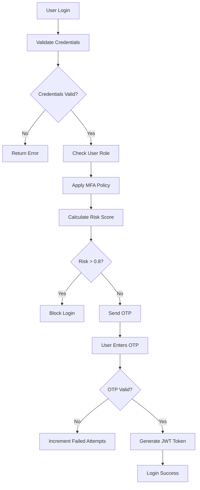
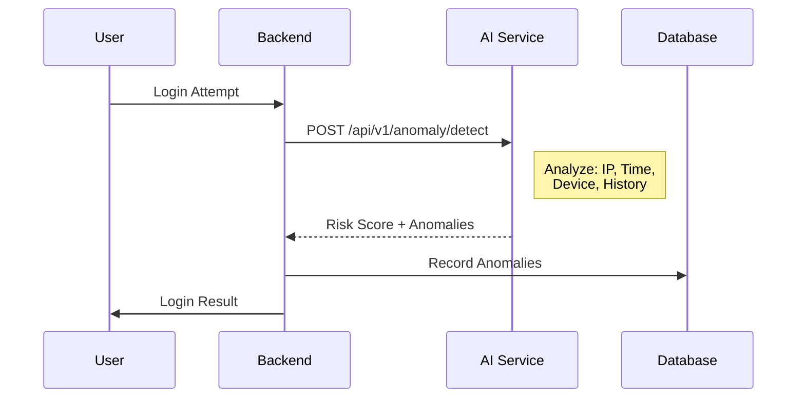
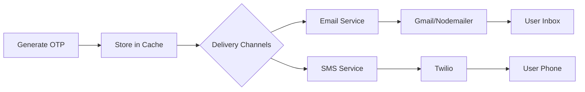

# ⭐ RentVerse - Special Features Explanation

<p align="center"><i>Comprehensive Documentation of RentVerse Platform's Unique Security & Functionality Features</i></p>

---

## 📋 Table of Contents

1. [Smart Multi-Factor Authentication (MFA)](#-1-smart-multi-factor-authentication-mfa)
2. [Digital Rental Agreements](#-2-digital-rental-agreements)
3. [AI-Powered Security Monitoring](#-3-ai-powered-security-monitoring)
4. [Multi-Tier API Rate Limiting](#-4-multi-tier-api-rate-limiting)
5. [Interactive Map Integration](#-5-interactive-map-integration)
6. [High-Speed OTP Delivery System](#-6-high-speed-otp-delivery-system)
7. [Comprehensive Activity Logging](#-7-comprehensive-activity-logging)
8. [Security Anomaly Detection](#-8-security-anomaly-detection)
9. [PDF Generation with Digital Signatures](#-9-pdf-generation-with-digital-signatures)
10. [CI/CD Security Pipeline](#-10-cicd-security-pipeline)
11. [Mobile-First Progressive Design](#-11-mobile-first-progressive-design)
12. [Cloud-Based Media Management](#-12-cloud-based-media-management)

---

## 🔐 1. Smart Multi-Factor Authentication (MFA)

### Overview

RentVerse implements an intelligent **Role-Based Multi-Factor Authentication** system that adapts security requirements based on user roles and detected risk levels.

### How It Works



### Role-Based Policies

| Role | MFA Required | Session Duration | Max Failed Attempts | Login Hours |
|------|--------------|------------------|---------------------|-------------|
| **ADMIN** | ✅ Mandatory | 15 minutes | 3 attempts | 6 AM - 10 PM |
| **LANDLORD** | ✅ Mandatory | 30 minutes | 5 attempts | 5 AM - 11 PM |
| **USER** | ❌ Optional | 60 minutes | 5 attempts | 24/7 |

### Key Features

1. **TOTP Support**: Integration with Google Authenticator via Speakeasy library
2. **QR Code Generation**: Easy setup for authenticator apps
3. **Backup Codes**: 10 recovery codes generated during MFA setup
4. **Device Verification**: Additional verification for new devices
5. **Risk-Based Blocking**: Automatic blocking if risk score exceeds 0.8

### Technical Implementation

**File:** `src/services/enhancedMFA.service.js`

```javascript
roleBasedMFAPolicies = {
  ADMIN: {
    requireMFA: true,
    allowedMethods: ['TOTP', 'SMS', 'EMAIL'],
    sessionTimeout: 15,
    maxFailedAttempts: 3,
    allowedLoginHours: { start: 6, end: 22 },
    requireDeviceVerification: true
  }
};
```

---

## 📄 2. Digital Rental Agreements

### Overview

RentVerse automatically generates **legally-binding PDF rental agreements** with cryptographic digital signatures when a booking is confirmed.

### How It Works



```mermaid
flowchart LR
    A[Booking Confirmed] --> B[Fetch Lease Data]
    B --> C[Generate HTML Template]
    C --> D[Render with Puppeteer]
    D --> E[Create PDF Buffer]
    E --> F[Generate SHA-256 Hash]
    F --> G[Upload to Cloudinary]
    G --> H[Save to Database]
    H --> I[Notify Both Parties]
```

### Document Contents

| Section | Information Included |
|---------|---------------------|
| **Header** | Agreement ID, Date, Logo |
| **Property Details** | Title, Address, Type, Amenities |
| **Parties** | Landlord & Tenant full details |
| **Terms** | Start/End dates, Rent amount |
| **Conditions** | House rules, Legal terms |
| **Signatures** | QR codes for landlord & tenant |
| **Security** | SHA-256 hash, Timestamp |

### Security Features

1. **SHA-256 Document Hash**: Ensures document integrity
2. **JWT-Based Signatures**: Cryptographic signing with 24-hour validity
3. **Nonce Generation**: 16-byte random nonce prevents replay attacks
4. **Tamper Detection**: Any modification invalidates the hash

### Technical Implementation

**Files:**
- `src/services/pdfGeneration.service.js`
- `src/services/digitalSignatureValidation.js`

```javascript
// Generate document hash for integrity
const digitalSignature = generateDocumentHash(pdfBuffer);
console.log(`✅ Document Secured. SHA-256 Hash: ${digitalSignature}`);

// Store with signature
await prisma.rentalAgreement.create({
  data: {
    leaseId, pdfUrl, fileName, fileSize,
    digitalSignature,
    signedAt: new Date()
  }
});
```

---

## 🤖 3. AI-Powered Security Monitoring

### Overview

RentVerse integrates with a **FastAPI-based AI service** that analyzes user behavior patterns to detect and flag suspicious activities in real-time.

### How It Works



### Detection Capabilities

| Pattern | Detection Method | Severity |
|---------|------------------|----------|
| Multiple Failed Logins | Count within 15-minute window | HIGH |
| Unusual Access Time | Login during 11 PM - 6 AM | MEDIUM |
| New Device | Unrecognized user agent/IP | MEDIUM |
| Rapid Session Changes | Multiple logins within 5 minutes | MEDIUM |
| Brute Force Attack | Sustained failed attempts | CRITICAL |
| Location Anomaly | IP geolocation mismatch | HIGH |

### AI Service Endpoints

| Endpoint | Method | Purpose |
|----------|--------|---------|
| `/api/v1/anomaly/detect` | POST | Analyze login for anomalies |
| `/api/v1/predictions/price` | POST | Property price prediction |
| `/health` | GET | Service health check |

### Technical Implementation

**File:** `src/services/securityAnomalyDetection.js`

```javascript
async analyzeWithAI(userData) {
  const response = await axios.post(`${this.aiServiceUrl}/api/v1/anomaly/detect`, {
    user_id: userData.userId,
    user_email: userData.userEmail,
    ip_address: userData.ipAddress,
    user_agent: userData.userAgent,
    login_success: userData.success,
    recent_activity: userData.recentActivity,
    analysis_type: 'security'
  });
  return response.data;
}
```

---

## ⏱️ 4. Multi-Tier API Rate Limiting

### Overview

RentVerse implements **8 different rate limiters** tailored for specific endpoint categories to prevent abuse while maintaining good user experience.

### Rate Limit Configuration

| Limiter Type | Limit | Time Window | Purpose |
|--------------|-------|-------------|---------|
| **General** | 100 requests | 15 minutes | Standard API protection |
| **Login** | 5 attempts | 15 minutes | Brute force prevention |
| **Registration** | 3 attempts | 1 hour | Signup abuse prevention |
| **OTP** | 3 requests | 10 minutes | OTP flooding prevention |
| **Admin** | 50 requests | 15 minutes | Admin endpoint protection |
| **Upload** | 10 uploads | 1 hour | Storage abuse prevention |
| **Search** | 200 requests | 15 minutes | Query abuse prevention |
| **Password Reset** | 3 requests | 1 hour | Reset flooding prevention |

### Response Headers

When rate limited, the API returns:

```json
{
  "success": false,
  "message": "Too many requests from this IP, please try again later.",
  "retryAfter": "15 minutes",
  "timestamp": "2025-12-17T00:00:00.000Z",
  "ip": "192.168.1.1"
}
```

### Technical Implementation

**File:** `src/middleware/rateLimiter.js`

```javascript
const rateLimiters = {
  general: createRateLimiter({ windowMs: 15 * 60 * 1000, max: 100 }),
  login: createRateLimiter({ windowMs: 15 * 60 * 1000, max: 5, skipSuccessfulRequests: true }),
  otp: createRateLimiter({ windowMs: 10 * 60 * 1000, max: 3 }),
  upload: createRateLimiter({ windowMs: 60 * 60 * 1000, max: 10 })
};
```

---

## 🗺️ 5. Interactive Map Integration

### Overview

RentVerse uses **MapTiler SDK** to provide interactive maps for property location selection and display.

### Features

| Feature | Description |
|---------|-------------|
| **Location Picker** | Landlords click on map to set exact coordinates |
| **Geocoding** | Address auto-completion from coordinates |
| **Property Display** | Show property locations with markers |
| **Distance Calculation** | Calculate distance from user's location |
| **Responsive Design** | Works on mobile and desktop |

### Use Cases

1. **Landlord (Creating Listing)**
   - Opens map in "Add Property" wizard
   - Clicks to pin exact location
   - System captures latitude/longitude
   - Address is auto-filled

2. **Tenant (Viewing Property)**
   - Property page shows interactive map
   - Zoom in/out to explore area
   - See nearby amenities

### Technical Implementation

**Frontend:** `rentverse-frontend/components/Map.tsx`

```javascript
import * as maptilersdk from '@maptiler/sdk';

// Initialize map
const map = new maptilersdk.Map({
  container: 'map',
  style: maptilersdk.MapStyle.STREETS,
  center: [longitude, latitude],
  zoom: 14
});

// Add marker for property
new maptilersdk.Marker()
  .setLngLat([property.longitude, property.latitude])
  .addTo(map);
```

---

## ⚡ 6. High-Speed OTP Delivery System

### Overview

RentVerse uses a **high-performance OTP delivery system** with parallel processing, connection pooling, and multiple delivery channels.

### Delivery Architecture



### Features

| Feature | Description |
|---------|-------------|
| **Parallel Delivery** | Email + SMS sent simultaneously |
| **Connection Pooling** | Max 5 connections, 100 messages |
| **Styled Templates** | Beautiful HTML emails with branding |
| **Delivery Tracking** | Unique delivery ID for each OTP |
| **Expiry Management** | OTPs expire after 5 minutes |
| **Rate Limiting** | 3 OTP requests per 10 minutes |

### Email Template Features

- Modern, responsive design
- Clear OTP display with large font
- Security warnings and tips
- Delivery ID for tracking
- Timestamp for audit

### Technical Implementation

**File:** `src/services/fastOTPService.js`

```javascript
async sendOTP(email, otp, options = {}) {
  const deliveryPromises = [];
  
  // Email delivery (primary)
  deliveryPromises.push(this.sendOTPEmail(email, otp, deliveryId));

  // SMS delivery (backup)
  if (this.smsProvider && options.sendSMS) {
    deliveryPromises.push(this.sendOTPSMS(phoneNumber, otp, deliveryId));
  }

  // Parallel execution
  const deliveryResults = await Promise.all(deliveryPromises);
  
  console.log(`📧 OTP delivered in ${totalDeliveryTime}ms`);
}
```

---

## 📊 7. Comprehensive Activity Logging

### Overview

Every security-relevant action in RentVerse is logged to the **ActivityLog** table for audit trails, compliance, and incident investigation.

### Logged Events

| Event Category | Actions Logged |
|----------------|----------------|
| **Authentication** | LOGIN_SUCCESS, LOGIN_FAILED, LOGOUT |
| **OTP** | OTP_GENERATED, OTP_VERIFIED, OTP_FAILED_INVALID |
| **MFA** | MFA_ENABLED, MFA_DISABLED, TOTP_SETUP |
| **Account** | PASSWORD_CHANGED, PROFILE_UPDATED |
| **Security** | ACCOUNT_LOCKED, SUSPICIOUS_ACTIVITY |
| **Admin** | USER_MODIFIED, ANOMALY_RESOLVED |

### Log Entry Structure

```javascript
{
  id: "uuid",
  userId: "user-uuid",
  action: "LOGIN_SUCCESS",
  ipAddress: "192.168.1.1",
  userAgent: "Mozilla/5.0...",
  details: {
    type: "MFA_SECURITY",
    method: "EMAIL",
    riskScore: 0.3,
    severity: "INFO"
  },
  createdAt: "2025-12-17T00:00:00.000Z"
}
```

### Admin Access

Administrators can:
- View all activity logs from dashboard
- Filter by user, action type, date range
- Export logs for compliance audits
- Investigate security incidents

### Technical Implementation

**File:** `src/services/activityLogger.js`

```javascript
async log(action, userId, details, ipAddress) {
  await prisma.activityLog.create({
    data: {
      action,
      userId,
      ipAddress,
      userAgent: details.userAgent,
      details: {
        type: details.type,
        severity: details.severity,
        metadata: details.metadata
      }
    }
  });
}
```

---

## 🛡️ 8. Security Anomaly Detection

### Overview

RentVerse's **Security Anomaly Detection** system monitors user behavior and flags suspicious patterns for admin review.

### Anomaly Types

| Type | Threshold | Severity | Auto-Alert |
|------|-----------|----------|------------|
| `FAILED_LOGIN` | 3+ in 15 min | HIGH | ✅ Yes |
| `MULTIPLE_FAILED_LOGINS` | 5+ in 15 min | HIGH | ✅ Yes |
| `UNUSUAL_ACCESS_TIME` | 11 PM - 6 AM | MEDIUM | ❌ No |
| `MULTIPLE_SESSIONS` | 2+ in 5 min | MEDIUM | ❌ No |
| `RATE_LIMIT_EXCEEDED` | 5+ breaches | HIGH | ✅ Yes |
| `BRUTE_FORCE` | Sustained pattern | CRITICAL | ✅ Yes |

### Thresholds Configuration

```javascript
anomalyThresholds = {
  failedLogins: 3,
  failedOTPs: 5,
  unusualHours: { start: 23, end: 6 },
  locationChangeThreshold: 100,  // KM
  apiRateLimitBreaches: 5,
  sessionDuration: { min: 300, max: 28800 }  // 5 min to 8 hours
};
```

### Admin Resolution Workflow

1. **Detection**: System detects anomaly
2. **Recording**: Anomaly saved to database with `resolved: false`
3. **Alert**: High/Critical anomalies trigger email alerts
4. **Review**: Admin views unresolved anomalies in dashboard
5. **Investigation**: Admin checks activity logs for context
6. **Resolution**: Admin marks anomaly as resolved with notes

### Technical Implementation

**File:** `src/services/securityAnomalyDetection.js`

```javascript
async recordAnomalies(userId, anomalies, ipAddress, userAgent) {
  await prisma.securityAnomaly.createMany({
    data: anomalies.map(anomaly => ({
      userId,
      type: anomaly.type,
      severity: anomaly.severity,
      description: anomaly.description,
      ipAddress,
      userAgent,
      metadata: anomaly.metadata,
      resolved: false
    }))
  });
}
```

---

## 📝 9. PDF Generation with Digital Signatures

### Overview

RentVerse uses **Puppeteer** (headless Chrome) to generate professional PDF rental agreements with embedded digital signatures.

### Generation Process

1. **Data Collection**: Fetch lease, property, tenant, landlord data
2. **Template Rendering**: EJS template with dynamic data
3. **QR Code Generation**: Create QR codes for both parties
4. **PDF Creation**: Puppeteer renders HTML to PDF (A4 format)
5. **Hash Generation**: SHA-256 hash of PDF buffer
6. **Cloud Upload**: Upload to Cloudinary CDN
7. **Database Storage**: Save URL, hash, and metadata

### PDF Contents

| Section | Details |
|---------|---------|
| Agreement Header | ID, Date, RentVerse logo |
| Property Info | Title, address, type, amenities |
| Landlord Details | Name, email, phone, signature QR |
| Tenant Details | Name, email, phone, signature QR |
| Terms | Start/end dates, rent amount |
| Legal Text | Terms and conditions |
| Security Footer | SHA-256 hash, generation timestamp |

### Technical Implementation

**File:** `src/services/pdfGeneration.service.js`

```javascript
async generateAndUploadRentalAgreementPDF(leaseId) {
  // 1. Get lease data
  const lease = await prisma.lease.findUnique({...});
  
  // 2. Generate QR codes
  const [landlordQR, tenantQR] = await Promise.all([...]);
  
  // 3. Render template
  const html = ejs.render(templateContent, templateData);
  
  // 4. Generate PDF with Puppeteer
  const browser = await puppeteer.launch({ headless: true });
  const pdfBuffer = await page.pdf({ format: 'A4' });
  
  // 5. Create hash
  const digitalSignature = generateDocumentHash(pdfBuffer);
  
  // 6. Upload to Cloudinary
  const uploadResult = await this.uploadPDFToCloudinary(pdfBuffer, fileName);
  
  // 7. Save to database
  await prisma.rentalAgreement.create({
    data: { leaseId, pdfUrl, digitalSignature, signedAt: new Date() }
  });
}
```

---

## ⚙️ 10. CI/CD Security Pipeline

### Overview

RentVerse implements automated security scanning in the GitHub Actions CI/CD pipeline using **6 different security tools**.

### Security Tools

| Tool | Purpose | Language Coverage |
|------|---------|-------------------|
| **Bandit** | Python SAST security linter | Python |
| **Semgrep** | Multi-language SAST | JavaScript, TypeScript, Python |
| **CodeQL** | Semantic code analysis | JavaScript, Python |
| **npm audit** | Dependency vulnerabilities | Node.js |
| **Safety** | Python package vulnerabilities | Python |
| **TruffleHog** | Secret/credential detection | All files |

### Pipeline Workflow

```yaml
# .github/workflows/security-scan.yml
name: 🛡️ Security Testing (SAST)

on:
  push:
    branches: [ main, develop ]
  pull_request:
    branches: [ main ]

jobs:
  security-scan:
    steps:
      - Checkout code
      - Setup Node.js 18
      - Setup Python 3.9
      - Install dependencies
      - Run Bandit (Python SAST)
      - Run Semgrep (JS/TS SAST)
      - Run CodeQL Analysis
      - Dependency Audit (npm + Safety)
      - Secret Detection (TruffleHog)
      - Upload Security Reports
      - Security Gate Check
```

### Semgrep Rule Sets

```yaml
config: >-
  p/security-audit
  p/secrets
  p/owasp-top-ten
  p/javascript
  p/typescript
```

### Technical Implementation

**File:** `.github/workflows/security-scan.yml`

---

## 📱 11. Mobile-First Progressive Design

### Overview

RentVerse is built with a **mobile-first approach** using Capacitor to generate native Android applications from the Next.js web app.

### Features

| Feature | Description |
|---------|-------------|
| **Native APK** | Standalone Android application |
| **Deep Linking** | `rentverseclarity://` URL scheme |
| **Responsive UI** | Works on all screen sizes |
| **Offline Support** | Cached assets for offline viewing |
| **Push Notifications** | Real-time booking updates |

### Capacitor Configuration

**File:** `rentverse-frontend/capacitor.config.ts`

```javascript
const config: CapacitorConfig = {
  appId: 'com.rentverse.app',
  appName: 'RentVerse',
  webDir: 'out',
  server: {
    url: 'https://rentverse-frontend-nine.vercel.app',
    cleartext: true
  },
  plugins: {
    PushNotifications: { presentationOptions: ["badge", "sound", "alert"] }
  }
};
```

### Building the APK

```bash
cd rentverse-frontend
npm run build
npx cap sync android
npx cap open android
# Build APK in Android Studio
```

---

## ☁️ 12. Cloud-Based Media Management

### Overview

RentVerse uses **Cloudinary CDN** for all media storage including property images and PDF rental agreements.

### Features

| Feature | Description |
|---------|-------------|
| **Auto Optimization** | Images auto-compressed for web |
| **CDN Delivery** | Global edge network for fast loading |
| **Secure Upload** | Signed upload requests |
| **Transformation** | Resize, crop, format on-the-fly |
| **PDF Storage** | Rental agreements stored securely |

### Upload Configuration

```javascript
const uploadParams = {
  public_id: `rentverse/rental-agreements/${fileName}`,
  resource_type: 'raw',
  format: 'pdf',
  type: 'upload',
  access_mode: 'public'
};

// Sign the upload request
const signature = cloudinary.utils.api_sign_request(params, API_SECRET);
```

### Storage Structure

```
cloudinary/
├── rentverse/
│   ├── properties/
│   │   └── {property-id}/
│   │       ├── image-1.jpg
│   │       └── image-2.jpg
│   └── rental-agreements/
│       └── rental-agreement-{lease-id}-{timestamp}.pdf
```

### Technical Implementation

**File:** `src/config/storage.js`

```javascript
const cloudinary = require('cloudinary').v2;

cloudinary.config({
  cloud_name: process.env.CLOUD_CLOUD_NAME,
  api_key: process.env.CLOUD_API_KEY,
  api_secret: process.env.CLOUD_API_SECRET
});
```

---

<div align="center">
  <p><i>These features combine to create a secure, user-friendly, and scalable property rental platform.</i></p>
  <p><i>© 2025 Team VECNA - RentVerse Platform</i></p>
</div>
