# 📊 RentVerse Technical Report

<p align="center"><i>Technical Documentation for Mobile SecOps 21 Days Challenge</i></p>

<div align="center">
  <b>Team VECNA | UiTM Tapah</b><br>
  <i>27 November 2025 - 17 December 2025</i>
</div>

---

## 📑 Table of Contents

1. [Technical Diagrams](#-technical-diagrams)
   - [System Architecture Overview](#1-system-architecture-overview)
   - [Authentication Flow (MFA/OTP)](#2-authentication-flow-mfaotp)
   - [Security Monitoring Flow](#3-security-monitoring-flow)
   - [CI/CD Security Pipeline](#4-cicd-security-pipeline)
2. [Code Annotations](#-code-annotations)
   - [Multi-Tier Rate Limiter](#1-multi-tier-rate-limiter-logic)
   - [SHA-256 Document Hashing](#2-sha-256-document-hashing-function)
   - [Role-Based MFA Policy](#3-role-based-mfa-policy-configuration)
3. [Rubric Compliance Table](#-rubric-compliance-table-owasp-mobile-top-10)
4. [Team Contributions](#-team-contributions)

---

## 🔧 Technical Diagrams

### 1. System Architecture Overview

```mermaid
flowchart TB
    subgraph Client["👤 Client Layer"]
        WEB["🌐 Web App<br/>Next.js 16"]
        MOBILE["📱 Mobile App<br/>Capacitor"]
    end

    subgraph Gateway["🔐 API Gateway"]
        AUTH["Authentication<br/>JWT + MFA"]
        RATE["Rate Limiting"]
        HELMET["Security Headers<br/>Helmet.js"]
    end

    subgraph Backend["⚙️ Backend Services"]
        EXPRESS["Express.js API"]
        PRISMA["Prisma ORM"]
        SERVICES["Business Logic"]
    end

    subgraph External["☁️ External Services"]
        SUPABASE["Supabase<br/>PostgreSQL"]
        CLOUDINARY["Cloudinary<br/>Media CDN"]
        RESEND["Resend<br/>Email API"]
        GOOGLE["Google OAuth"]
        AI["RevAI<br/>Auto-Review"]
    end

    subgraph DevOps["🔄 DevSecOps"]
        GITHUB["GitHub Actions"]
        CODEQL["CodeQL + Trivy"]
        VERCEL["Vercel Deploy"]
        RENDER["Render Deploy"]
    end

    WEB --> Gateway
    MOBILE --> Gateway
    Gateway --> Backend
    Backend --> External
    GITHUB --> CODEQL
    GITHUB --> VERCEL
    GITHUB --> RENDER
```



#### Diagram Explanation

**Client Layer (Web App & Mobile App):** The client layer consists of two primary interfaces through which users interact with RentVerse. The **Web App** is built using Next.js 16, a React-based framework that provides server-side rendering and optimized performance for property browsing and booking operations. The **Mobile App** is powered by Capacitor, which wraps the web application into a native Android APK, enabling a seamless mobile experience with features like deep linking and push notifications.

**API Gateway (Authentication, Rate Limiting, Security Headers):** The API Gateway serves as the first line of defense for all incoming requests. The **Authentication** component validates JWT tokens and enforces Multi-Factor Authentication (MFA) for privileged users. The **Rate Limiting** middleware prevents brute force attacks by limiting request frequency per IP address. **Helmet.js** adds critical security headers including Content Security Policy (CSP), X-Frame-Options, and HSTS to protect against XSS, clickjacking, and man-in-the-middle attacks.

**Backend Services (Express.js, Prisma ORM, Business Logic):** The backend is powered by **Express.js**, a lightweight Node.js framework that handles API routing and middleware orchestration. **Prisma ORM** provides type-safe database access to PostgreSQL, ensuring data integrity and preventing SQL injection through parameterized queries. The **Business Logic** layer encapsulates core platform functionality including property management, booking workflows, and digital agreement generation.

**External Services (Supabase, Cloudinary, Resend, Google OAuth, RevAI):** RentVerse integrates with several cloud services to enhance functionality. **Supabase** provides a managed PostgreSQL database with automatic backups. **Cloudinary** serves as the CDN for all media assets, optimizing images and storing PDF rental agreements. **Resend** handles transactional email delivery for OTP codes and notifications. **Google OAuth** enables social login functionality. **RevAI** powers the AI-based property auto-review system.

**DevSecOps Layer (GitHub Actions, CodeQL, Vercel, Render):** The DevSecOps pipeline automates security testing and deployment. **GitHub Actions** orchestrates the CI/CD workflow, triggering builds on every push. **CodeQL and Trivy** perform static analysis and vulnerability scanning. **Vercel** hosts the frontend with automatic SSL and CDN distribution, while **Render** hosts the backend with managed PostgreSQL connections.

---

### 2. Authentication Flow (MFA/OTP)

```mermaid
sequenceDiagram
    participant U as 👤 User
    participant F as 🌐 Frontend
    participant A as 🔐 Auth API
    participant D as 🗄️ Database
    participant E as 📧 Email Service

    U->>F: Enter email & password
    F->>A: POST /auth/login
    A->>D: Verify credentials
    
    alt Invalid Credentials
        A-->>F: 401 Unauthorized
        A->>D: Log failed attempt
        D-->>A: Check attempt count
        alt 5+ Failed Attempts
            A->>E: Send security alert
            A->>D: Lock account 15 min
        end
    else Valid Credentials
        A->>D: Check MFA status
        alt MFA Enabled
            A->>A: Generate 6-digit OTP
            A->>D: Store hashed OTP
            A->>E: Send OTP email
            A-->>F: Require OTP verification
            U->>F: Enter OTP code
            F->>A: POST /auth/verify-otp
            A->>D: Verify OTP hash
            alt Valid OTP
                A->>D: Log successful login
                A->>D: Register device fingerprint
                A-->>F: Return JWT token
            else Invalid OTP
                A-->>F: 401 Invalid OTP
                A->>D: Increment failed OTP count
            end
        else MFA Disabled
            A->>D: Log successful login
            A-->>F: Return JWT token
        end
    end
```



#### Diagram Explanation

**Initial Login Request (User → Frontend → Auth API):** When a user initiates login, the frontend captures the email and password credentials and sends them to the Auth API via a POST request to `/auth/login`. This request is immediately subjected to rate limiting (5 attempts per 15 minutes) to prevent brute force attacks. The credentials are transmitted over HTTPS to ensure data encryption in transit.

**Credential Verification (Auth API → Database):** The Auth API queries the database to verify the user's credentials. Passwords are never stored in plaintext; instead, they are hashed using bcrypt with a cost factor of 10. The API compares the submitted password hash against the stored hash. If the credentials are invalid, the system logs the failed attempt and checks if the user has exceeded the maximum allowed failures (configurable per role: 3 for ADMIN, 5 for others).

**Account Lockout Mechanism (Failed Attempts):** When a user exceeds the maximum failed login attempts, the system automatically locks the account for 15 minutes. This lockout is enforced at the database level by setting a `lockedUntil` timestamp. Additionally, a security alert email is sent to notify the user of suspicious activity on their account, contributing to the system's **resilience** against brute force attacks.

**MFA/OTP Verification Flow:** For users with MFA enabled (mandatory for ADMIN and LANDLORD roles), the system generates a cryptographically secure 6-digit OTP using the Speakeasy library. This OTP is hashed before storage and sent to the user's email via the Resend API. The OTP expires after 5 minutes. Upon successful OTP verification, the system generates a JWT token with role-based expiry (15 min for ADMIN, 30 min for LANDLORD, 60 min for USER) and registers the device fingerprint for future zero-trust validation.

---

### 3. Security Monitoring Flow


#### Diagram Explanation

**Security Events Capture:** The system monitors five primary security event types that could indicate malicious activity. **Login Attempts** are logged regardless of success or failure. **Failed Logins** trigger incremental risk scoring. **New Device Detection** occurs when a user's device fingerprint (SHA-256 hash of User-Agent + IP) doesn't match any previously registered devices. **Password Changes** are logged for audit compliance. **Rate Limit Breaches** indicate potential API abuse or automated attack attempts.

**Risk Analysis Engine:** Every security event passes through the Risk Analysis Engine, which calculates a cumulative risk score based on multiple factors. New devices add +30 points, failed attempts add +25 points (if >5 in an hour), and unusual login times (2-5 AM) add +15 points. The engine checks for anomaly patterns by analyzing the user's 24-hour activity history. If the cumulative score reaches or exceeds 50, the event is flagged as **high risk** and escalated for automated response.

**Automated Response System:** High-risk events trigger an automated response chain. A **Security Alert** record is created in the database with severity level (MEDIUM, HIGH, CRITICAL) and detailed metadata. An **Email Notification** is sent to both the user and administrators for immediate awareness. If the event involves 5+ consecutive failed logins, the system automatically **locks the account** for 15 minutes. All events are recorded in the **ActivityLog** table for forensic analysis and compliance auditing.

**Admin Dashboard Integration:** The security data flows into the Admin Dashboard for real-time visualization. **Real-time Statistics** display 24-hour metrics including total logins, failure rates, and high-risk login counts. The **Login History Table** provides paginated, filterable access to all login records. **Unresolved Alerts** require admin action to investigate and resolve. The **Users at Risk List** highlights accounts with elevated risk scores for proactive security management.

---

### 4. CI/CD Security Pipeline

```mermaid
flowchart LR
    subgraph Trigger["🚀 Trigger Events"]
        T1["Push to main"]
        T2["Push to develop"]
        T3["Pull Request"]
    end

    subgraph SAST["🔬 Static Analysis (SAST)"]
        S1["ESLint<br/>Code Quality"]
        S2["TypeScript<br/>Type Safety"]
        S3["Bandit<br/>Python Security"]
        S4["Semgrep<br/>OWASP Rules"]
    end

    subgraph Security["🔐 Security Scanning"]
        SEC1["CodeQL<br/>Semantic Analysis"]
        SEC2["TruffleHog<br/>Secret Detection"]
        SEC3["Trivy<br/>Vulnerability Scan"]
        SEC4["npm audit<br/>Dependency Check"]
        SEC5["Safety<br/>Python Packages"]
    end

    subgraph Gates["🚦 Quality Gates"]
        G1{"Critical<br/>Vulnerabilities?"}
        G2{"Secrets<br/>Detected?"}
        G3{"High-Severity<br/>CVEs?"}
    end

    subgraph Result["📋 Pipeline Result"]
        R1["❌ Build Failed"]
        R2["📊 Generate Report"]
        R3["✅ Build Passed"]
        R4["🚀 Auto-Deploy"]
    end

    T1 --> SAST
    T2 --> SAST
    T3 --> SAST
    SAST --> Security
    Security --> G1
    G1 -->|Yes| R1
    G1 -->|No| G2
    G2 -->|Yes| R1
    G2 -->|No| G3
    G3 -->|Yes| R1
    G3 -->|No| R2
    R2 --> R3
    R3 --> R4
```



#### Diagram Explanation

**Trigger Events:** The CI/CD pipeline is triggered automatically on three events: pushes to the `main` branch (production), pushes to the `develop` branch (staging), and Pull Requests targeting `main`. This ensures that all code changes undergo security scrutiny before reaching production. The pipeline runs on Ubuntu-latest runners provided by GitHub Actions, ensuring consistent and reproducible build environments.

**Static Analysis (SAST) Phase:** The first phase performs static code analysis without executing the code. **ESLint** enforces JavaScript/TypeScript code quality rules with zero tolerance for warnings (`--max-warnings 0`). **TypeScript** compilation verifies type safety across the frontend codebase. **Bandit** scans Python code in the AI service for common security issues like hardcoded passwords and SQL injection. **Semgrep** applies OWASP Top 10 rule sets to detect security vulnerabilities in JavaScript and TypeScript files.

**Security Scanning Phase:** This phase performs deep security analysis. **CodeQL** provides semantic code analysis, understanding data flow to detect complex vulnerabilities like taint tracking. **TruffleHog** scans the entire repository for exposed secrets, API keys, and credentials using entropy analysis and regex patterns. **Trivy** scans container images and filesystem for HIGH and CRITICAL CVEs. **npm audit** checks Node.js dependencies for known vulnerabilities. **Safety** performs the same check for Python packages.

**Quality Gates and Deployment:** The pipeline enforces strict quality gates that must pass before deployment. Any **critical vulnerability** detected by CodeQL or Trivy fails the build. Any **exposed secret** detected by TruffleHog fails the build immediately. Any **high-severity CVE** in dependencies fails the build. Only after passing all gates does the pipeline generate a security report, mark the build as passed, and trigger automatic deployment to Vercel (frontend) and Render (backend). This ensures that no insecure code reaches production, embodying the **"shift-left security"** principle of DevSecOps.

---

## 💻 Code Annotations

### 1. Multi-Tier Rate Limiter Logic

**File:** `src/middleware/rateLimiter.js`

```javascript
const rateLimit = require('express-rate-limit');

// Factory function to create rate limiters with consistent configuration
const createRateLimiter = (options) => {
  return rateLimit({
    windowMs: options.windowMs,
    max: options.max,
    message: {
      success: false,
      message: 'Too many requests from this IP, please try again later.',
      retryAfter: `${options.windowMs / 60000} minutes`,
      timestamp: new Date().toISOString(),
    },
    standardHeaders: true,  // Return rate limit info in headers
    legacyHeaders: false,   // Disable deprecated X-RateLimit-* headers
    skipSuccessfulRequests: options.skipSuccessfulRequests || false,
    keyGenerator: (req) => req.ip,  // Rate limit by IP address
  });
};

// Multi-tier rate limiting configuration
const rateLimiters = {
  // General API protection - 100 requests per 15 minutes
  general: createRateLimiter({ 
    windowMs: 15 * 60 * 1000, 
    max: 100 
  }),
  
  // Login endpoint - 5 attempts per 15 minutes (only counts failures)
  login: createRateLimiter({ 
    windowMs: 15 * 60 * 1000, 
    max: 5, 
    skipSuccessfulRequests: true 
  }),
  
  // Registration - 3 attempts per hour
  register: createRateLimiter({ 
    windowMs: 60 * 60 * 1000, 
    max: 3 
  }),
  
  // OTP requests - 3 per 10 minutes
  otp: createRateLimiter({ 
    windowMs: 10 * 60 * 1000, 
    max: 3 
  }),
  
  // Admin endpoints - 50 per 15 minutes
  admin: createRateLimiter({ 
    windowMs: 15 * 60 * 1000, 
    max: 50 
  }),
  
  // File uploads - 10 per hour
  upload: createRateLimiter({ 
    windowMs: 60 * 60 * 1000, 
    max: 10 
  }),
  
  // Password reset - 3 per hour
  passwordReset: createRateLimiter({ 
    windowMs: 60 * 60 * 1000, 
    max: 3 
  }),
};

module.exports = rateLimiters;
```

#### Code Logic Explanation

This rate limiter implementation is a critical component of the system's **resilience** against Denial of Service (DoS) attacks and brute force attempts. The code uses a **factory pattern** (`createRateLimiter`) to ensure consistent configuration across all rate limiters while allowing customization of window duration and maximum requests.

The **multi-tier approach** recognizes that different endpoints have different risk profiles. Authentication endpoints (`login`, `otp`, `passwordReset`) have stricter limits because they are common attack vectors. The login limiter uniquely uses `skipSuccessfulRequests: true`, meaning successful logins don't count against the limit—only failed attempts do. This prevents legitimate users from being locked out while still blocking attackers.

Each limiter uses the client's IP address as the rate limit key via `keyGenerator: (req) => req.ip`. The response includes RFC-compliant rate limit headers (`standardHeaders: true`) that inform clients of their remaining quota, enabling well-behaved clients to implement backoff strategies. The structured error message includes a timestamp and retry duration, improving debugging and user experience.

This implementation directly addresses **OWASP M4 (Insufficient Input/Output Validation)** by preventing automated attacks from overwhelming the system.

---

### 2. SHA-256 Document Hashing Function

**File:** `src/services/pdfGeneration.service.js`

```javascript
const crypto = require('crypto');

/**
 * Generates a SHA-256 hash of a document buffer for integrity verification.
 * This hash serves as the digital signature for rental agreements.
 * 
 * @param {Buffer} buffer - The PDF document buffer to hash
 * @returns {string} - Hexadecimal representation of the SHA-256 hash
 */
function generateDocumentHash(buffer) {
  // Create SHA-256 hash object
  const hash = crypto.createHash('sha256');
  
  // Update hash with the document buffer
  hash.update(buffer);
  
  // Return hexadecimal digest (64 characters)
  const digitalSignature = hash.digest('hex');
  
  console.log(`✅ Document Secured. SHA-256 Hash: ${digitalSignature}`);
  
  return digitalSignature;
}

/**
 * Generates and uploads a rental agreement PDF with digital signature.
 */
async generateAndUploadRentalAgreementPDF(leaseId) {
  // 1. Fetch lease data with all relationships
  const lease = await prisma.lease.findUnique({
    where: { id: leaseId },
    include: {
      property: true,
      tenant: true,
      landlord: true,
    },
  });

  // 2. Render HTML template with EJS
  const templatePath = path.join(__dirname, '../templates/rental-agreement.ejs');
  const templateContent = fs.readFileSync(templatePath, 'utf-8');
  const html = ejs.render(templateContent, { lease, property, tenant, landlord });

  // 3. Generate PDF using Puppeteer headless browser
  const browser = await puppeteer.launch({ 
    headless: true, 
    args: ['--no-sandbox', '--disable-setuid-sandbox'] 
  });
  const page = await browser.newPage();
  await page.setContent(html, { waitUntil: 'networkidle0' });
  const pdfBuffer = await page.pdf({ 
    format: 'A4', 
    printBackground: true,
    margin: { top: '20mm', bottom: '20mm', left: '15mm', right: '15mm' }
  });
  await browser.close();

  // 4. Generate SHA-256 hash for document integrity
  const digitalSignature = generateDocumentHash(pdfBuffer);

  // 5. Upload PDF to Cloudinary
  const uploadResult = await this.uploadPDFToCloudinary(pdfBuffer, fileName);

  // 6. Store in database with digital signature
  const agreement = await prisma.rentalAgreement.create({
    data: {
      leaseId,
      pdfUrl: uploadResult.secure_url,
      fileName,
      fileSize: pdfBuffer.length,
      digitalSignature,  // SHA-256 hash stored here
      signedAt: new Date(),
    },
  });

  return agreement;
}
```

#### Code Logic Explanation

This SHA-256 hashing function is fundamental to the system's **integrity** guarantees for rental agreements. The `generateDocumentHash` function uses Node.js's built-in `crypto` module to create a cryptographic hash of the PDF document buffer. SHA-256 produces a 256-bit (64 hexadecimal character) digest that uniquely represents the document content.

The hash serves multiple purposes: **tamper detection** (any modification to the PDF changes the hash), **non-repudiation** (parties cannot deny the document content), and **audit compliance** (hash is stored in the database for verification). When either party wants to verify document authenticity, they can regenerate the hash from their PDF copy and compare it against the stored hash.

The workflow demonstrates defense-in-depth: the PDF is generated server-side using Puppeteer (preventing client-side manipulation), the hash is computed before upload (ensuring the stored hash matches the uploaded file), and the hash is persisted in the database (creating an immutable audit record). This directly addresses **OWASP M5 (Insufficient Cryptography)** by using industry-standard SHA-256 rather than weaker algorithms like MD5 or SHA-1.

---

### 3. Role-Based MFA Policy Configuration

**File:** `src/services/enhancedMFA.service.js`

```javascript
class EnhancedMFAService {
  constructor() {
    // Role-based MFA policies with varying security levels
    this.roleBasedMFAPolicies = {
      ADMIN: {
        requireMFA: true,                    // MFA is mandatory
        allowedMethods: ['TOTP', 'SMS', 'EMAIL'],
        sessionTimeout: 15,                  // 15 minutes
        maxFailedAttempts: 3,                // Stricter limit
        allowedLoginHours: { start: 6, end: 22 },  // 6 AM - 10 PM
        requireDeviceVerification: true,
        alertOnNewDevice: true,
        requirePasswordChange: 90,           // Every 90 days
      },
      LANDLORD: {
        requireMFA: true,
        allowedMethods: ['TOTP', 'EMAIL'],
        sessionTimeout: 30,                  // 30 minutes
        maxFailedAttempts: 5,
        allowedLoginHours: { start: 5, end: 23 },  // 5 AM - 11 PM
        requireDeviceVerification: true,
        alertOnNewDevice: true,
      },
      USER: {
        requireMFA: false,                   // Optional for regular users
        allowedMethods: ['EMAIL'],
        sessionTimeout: 60,                  // 1 hour
        maxFailedAttempts: 5,
        allowedLoginHours: { start: 0, end: 24 },  // 24/7
        requireDeviceVerification: false,
        alertOnNewDevice: false,
      },
    };
  }

  /**
   * Detects suspicious activity and calculates risk score
   */
  async detectSuspiciousActivity(user, ipAddress, userAgent) {
    let riskScore = 0;
    const reasons = [];
    const policy = this.roleBasedMFAPolicies[user.role];

    // Check failed login attempts (+0.3)
    if (user.loginAttempts > 0) {
      riskScore += 0.3;
      reasons.push(`Previous failed attempts: ${user.loginAttempts}`);
    }

    // Check for rapid successive logins (+0.2)
    const hoursSinceLastLogin = (Date.now() - new Date(user.lastLoginAt)) / (1000 * 60 * 60);
    if (hoursSinceLastLogin < 1) {
      riskScore += 0.2;
      reasons.push('Rapid successive login attempts');
    }

    // Check login time against policy (+0.4)
    const currentHour = new Date().getHours();
    if (currentHour < policy.allowedLoginHours.start || 
        currentHour >= policy.allowedLoginHours.end) {
      riskScore += 0.4;
      reasons.push(`Login outside allowed hours (${policy.allowedLoginHours.start}-${policy.allowedLoginHours.end})`);
    }

    // Check for new device (+0.3)
    const deviceHash = this.generateDeviceHash(userAgent, ipAddress);
    const knownDevice = await this.checkKnownDevice(user.id, deviceHash);
    if (!knownDevice) {
      riskScore += 0.3;
      reasons.push('New or unrecognized device');
    }

    return {
      riskScore: Math.min(riskScore, 1.0),  // Cap at 1.0
      blocked: riskScore > 0.8,
      reasons,
      requiresMFA: policy.requireMFA || riskScore > 0.5,
    };
  }
}

module.exports = new EnhancedMFAService();
```

#### Code Logic Explanation

This Role-Based MFA implementation is central to the system's **authentication resilience**. The code defines escalating security requirements based on user roles, recognizing that administrator and landlord accounts pose greater risks if compromised. ADMIN accounts have the strictest policies: mandatory MFA, 15-minute session timeout, only 3 failed attempts before lockout, and restricted login hours.

The `detectSuspiciousActivity` method implements **adaptive authentication** by calculating a cumulative risk score. Each risk factor contributes to the score: previous failed attempts (+0.3), rapid successive logins (+0.2), unusual hours (+0.4), and new devices (+0.3). If the score exceeds 0.8, the login is blocked entirely. If it exceeds 0.5, MFA is enforced even for USER accounts that don't normally require it.

This approach provides **defense-in-depth**: even if an attacker obtains valid credentials, behavioral anomalies (logging in at 3 AM from a new device with previous failed attempts) will trigger additional verification or outright blocking. This directly addresses **OWASP M2 (Insecure Authentication)** by implementing multiple verification factors and contextual security decisions.

---

## 📊 Rubric Compliance Table (OWASP Mobile Top 10)

The following table maps each RentVerse security module to the OWASP Mobile Top 10 risks, demonstrating comprehensive coverage of mobile security threats.

| OWASP Risk | Risk Description | RentVerse Module | Implementation Details | Status |
|:----------:|:-----------------|:-----------------|:-----------------------|:------:|
| **M1** | Improper Platform Usage | Module 1: Secure Login & MFA<br>Module 5: Activity Log Dashboard | Role-based access control with JWT tokens. Activity logging for all security events. Admin dashboard for monitoring platform usage patterns. | ✅ |
| **M2** | Insecure Data Storage | Module 3: Digital Agreement<br>Category 2: Zero-Trust | Passwords hashed with bcrypt (cost factor 10). OTPs hashed before storage. Digital signatures stored as SHA-256 hashes. No sensitive data in local storage. | ✅ |
| **M3** | Insecure Communication | Module 2: Secure API Gateway | HTTPS enforced via Helmet.js. TLS 1.2+ required for all API calls. Secure headers (HSTS, X-Content-Type-Options). CORS whitelist configuration. | ✅ |
| **M4** | Insecure Authentication | Module 1: Secure Login & MFA<br>Category 1: Threat Intelligence | Multi-factor authentication with OTP. Role-based MFA policies. Risk-based adaptive authentication. Account lockout after failed attempts. Device fingerprinting. | ✅ |
| **M5** | Insufficient Cryptography | Module 3: Digital Agreement | SHA-256 for document hashing. JWT RS256 for token signing. Bcrypt for password hashing. Cryptographically secure OTP generation via Speakeasy. | ✅ |
| **M6** | Insecure Authorization | Module 4: Smart Notification<br>Category 3: Adaptive Defense | RBAC middleware validates user roles. JWT contains role claims. API routes protected by role-specific middleware. Anomaly detection flags unauthorized access patterns. | ✅ |
| **M7** | Client Code Quality | Module 6: CI/CD Security Testing<br>Category 4: Automated Testing | ESLint enforces code quality. TypeScript provides type safety. Semgrep scans for OWASP vulnerabilities. CodeQL performs semantic analysis. npm audit checks dependencies. | ✅ |
| **M8** | Code Tampering | Module 6: CI/CD Security<br>Module 3: Digital Agreement | Git-based version control prevents unauthorized code changes. Digital signatures detect document tampering. Integrity checks on critical files. | ✅ |
| **M9** | Reverse Engineering | Module 2: Secure API Gateway | API responses don't expose internal implementation. Error messages are generic. Source maps disabled in production. | ✅ |
| **M10** | Extraneous Functionality | Module 6: CI/CD Security | Gitleaks detects exposed secrets. Debug endpoints removed in production. Environment-specific configuration. Security gate blocks deployment of debug code. | ✅ |

### Compliance Summary

| Category | Coverage |
|:---------|:--------:|
| **Core OWASP Risks (M1-M7)** | 7/7 (100%) |
| **Extended Risks (M8-M10)** | 3/3 (100%) |
| **Total Coverage** | **10/10 (100%)** |

---

## 👥 Team Contributions

### Team Overview

| Member | Student ID | Primary Role | Secondary Role |
|:-------|:-----------|:-------------|:---------------|
| **Mohamad Bukhari bin Ahmad Huzairi** | 2024916761 | Backend Development | Cloud Infrastructure |
| **Muhamad Zulkarnain bin Samsudin** | 2024793133 | Frontend Development | Beta Testing |
| **Aqil Imran bin Norhidzam** | 2024779269 | Security Lead | Documentation |

---

### Mohamad Bukhari bin Ahmad Huzairi
**Role:** Backend & Cloud Infrastructure

#### Tasks Completed

| Task Category | Specific Contributions |
|:--------------|:-----------------------|
| **API Development** | Designed and implemented RESTful API architecture using Express.js. Created 40+ endpoints covering authentication, properties, bookings, and admin functions. Implemented middleware chain for request processing. |
| **Database Design** | Designed PostgreSQL schema with Prisma ORM. Created 15+ models including User, Property, Booking, Lease, RentalAgreement, ActivityLog, and SecurityAnomaly. Implemented database migrations and seeding scripts. |
| **Authentication System** | Built JWT-based authentication with role-based access control. Implemented OTP generation and verification using Speakeasy library. Created session management with token blacklisting. |
| **Security Modules** | Developed `enhancedMFA.service.js` with role-based policies. Implemented `securityAnomalyDetection.js` for threat detection. Created `suspiciousActivity.service.js` for risk scoring. |
| **Cloud Integration** | Configured Supabase PostgreSQL database. Set up Cloudinary for media storage and PDF hosting. Integrated Resend email API for transactional emails. Deployed backend to Railway/Render. |
| **PDF Generation** | Implemented Puppeteer-based PDF generation for rental agreements. Created EJS templates for professional document styling. Integrated SHA-256 hashing for document integrity. |

#### Key Files Contributed
- `src/app.js` - Main Express application
- `src/middleware/auth.js` - JWT authentication middleware
- `src/middleware/rateLimiter.js` - Multi-tier rate limiting
- `src/middleware/security.js` - Security headers and protection
- `src/services/enhancedMFA.service.js` - Role-based MFA
- `src/services/pdfGeneration.service.js` - PDF generation service
- `src/services/securityAnomalyDetection.js` - Anomaly detection
- `prisma/schema.prisma` - Database schema

---

### Muhamad Zulkarnain bin Samsudin
**Role:** Frontend & Beta Testing

#### Tasks Completed

| Task Category | Specific Contributions |
|:--------------|:-----------------------|
| **Frontend Development** | Built responsive Next.js 16 application with React 19.1. Implemented 20+ pages including authentication, property listing, booking, and admin dashboard. Used TypeScript for type-safe development. |
| **UI/UX Design** | Designed modern UI using Tailwind CSS v4. Created reusable component library. Implemented responsive layouts for mobile and desktop. Added micro-interactions and loading states. |
| **State Management** | Implemented Zustand v5 for global state. Created stores for auth, user, and property data. Handled token persistence and refresh logic. |
| **Map Integration** | Integrated MapTiler SDK v3.8 for property location display. Implemented location picker for landlords. Added geocoding for address lookup. |
| **Form Handling** | Built multi-step property listing wizard. Implemented form validation with error handling. Created image upload with preview functionality. |
| **Mobile App** | Configured Capacitor v8 for Android build. Set up deep linking with `rentverseclarity://` scheme. Tested APK on multiple Android devices. |
| **Beta Testing** | Conducted end-to-end testing of user flows. Identified and reported 25+ bugs during development. Performed cross-browser compatibility testing. Validated mobile app functionality. |

#### Key Files Contributed
- `app/page.tsx` - Homepage with property listings
- `app/auth/*` - Authentication pages (login, register, forgot-password)
- `app/property/*` - Property listing and details pages
- `app/rents/*` - User bookings dashboard
- `app/admin/*` - Admin dashboard
- `app/account/*` - User profile and security settings
- `components/*` - Reusable UI components
- `stores/*` - Zustand state stores
- `capacitor.config.ts` - Mobile app configuration

---

### Aqil Imran bin Norhidzam
**Role:** Security Lead & Documentation

#### Tasks Completed

| Task Category | Specific Contributions |
|:--------------|:-----------------------|
| **Security Architecture** | Designed overall security architecture aligned with OWASP Mobile Top 10. Defined role-based MFA policies. Specified rate limiting rules. Created security event taxonomy. |
| **CI/CD Security Pipeline** | Created `.github/workflows/security-scan.yml`. Configured 6 security scanning tools (Bandit, Semgrep, CodeQL, npm audit, Safety, TruffleHog). Implemented quality gates for deployment. |
| **Security Headers** | Configured Helmet.js with CSP, HSTS, X-Frame-Options. Defined CORS whitelist. Implemented XSS and SQL injection protection middleware. |
| **Threat Modeling** | Identified attack vectors (brute force, credential stuffing, session hijacking). Designed countermeasures for each threat. Created risk scoring algorithm. |
| **Documentation** | Authored comprehensive README.md (1,200+ lines). Created API_Documentation.md with all endpoints. Wrote Deployment_Guide.md for DevOps. Created Special_Features_Explanation.md with 12 feature details. |
| **Technical Report** | Created this report.md with technical diagrams. Wrote code annotations explaining security implementations. Compiled OWASP compliance table. Documented team contributions. |
| **Security Testing** | Performed manual security testing (input validation, authentication bypass). Validated rate limiting effectiveness. Tested OTP expiry and lockout mechanisms. |

#### Key Files Contributed
- `.github/workflows/security-scan.yml` - CI/CD security pipeline
- `src/middleware/security.js` - Security middleware configuration
- `README.md` - Comprehensive project documentation
- `README_ver2.md` - Version 2 documentation
- `How-to-use.md` - User guide
- `Special_Features_Explanation.md` - Feature documentation
- `API_Documentation.md` - API reference
- `Deployment_Guide.md` - Deployment instructions
- `report.md` - This technical report

---

### Collaboration Summary

| Collaboration Aspect | Evidence |
|:---------------------|:---------|
| **Code Reviews** | All team members reviewed each other's Pull Requests before merging to main branch. |
| **Daily Standups** | Team held daily sync meetings to discuss progress and blockers. |
| **Knowledge Sharing** | Bukhari trained team on backend APIs. Zulkarnain demonstrated frontend components. Aqil briefed team on security requirements. |
| **Integration Testing** | Joint testing sessions to validate frontend-backend integration. |
| **Documentation Review** | All documentation reviewed by entire team for accuracy. |

---

<div align="center">
  <p><i>Report prepared by Team VECNA</i></p>
  <p><i>Mobile SecOps 21 Days Challenge 2025</i></p>
  <p><i>© 2025 Metairflow R&D Sdn. Bhd.</i></p>
</div>
